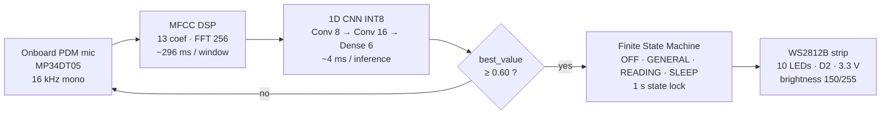
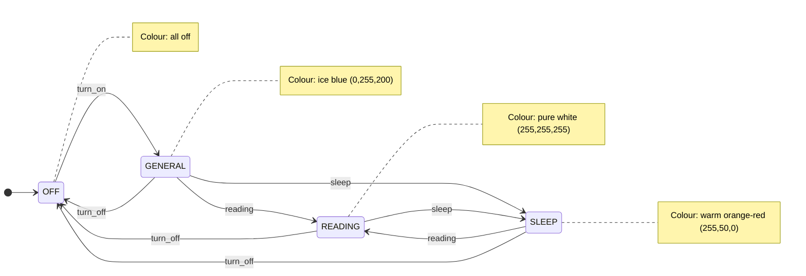
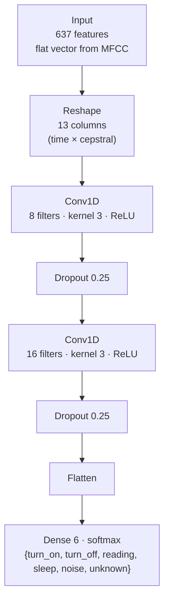

# Self-drawn diagrams (mermaid sources)

These three diagrams render natively on GitHub and can be embedded into the
report by either pasting the mermaid source, or by exporting each block to PNG
via the Mermaid Live Editor (https://mermaid.live) into this same directory.

---

## 1. System overview

---

## 2. State machine

`noise` and `unknown` predictions are silently ignored (no transition).
Predictions with `best_value < 0.60` are treated as `uncertain` and ignored.
A 1 s state lock after each accepted transition prevents a single utterance
being re-classified across multiple frames.

---

## 3. Model architecture (baseline)

INT8 quantization applied post-training. On-device estimate (Cortex-M4F):
~4 ms inference, ~12.5 KB peak RAM, ~46.4 KB flash.
