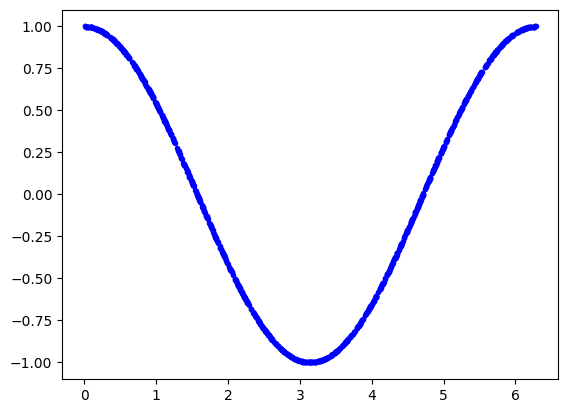
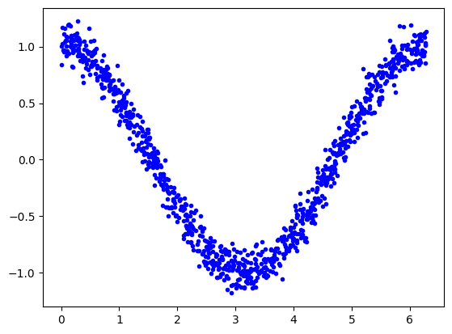
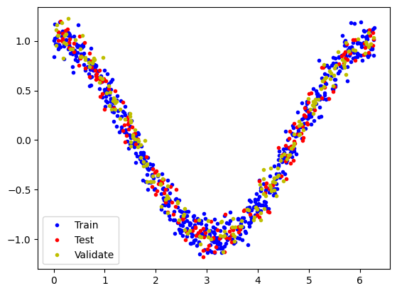
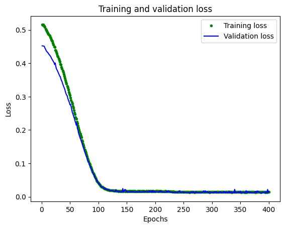
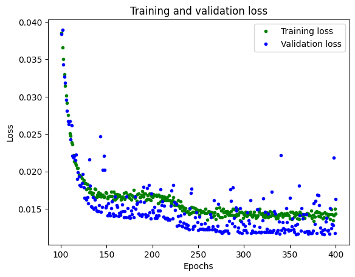
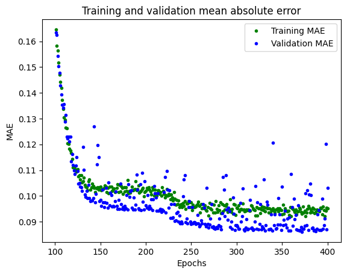
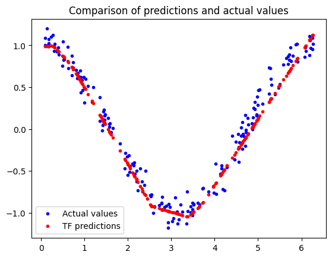
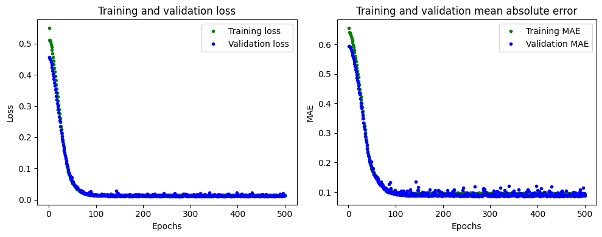
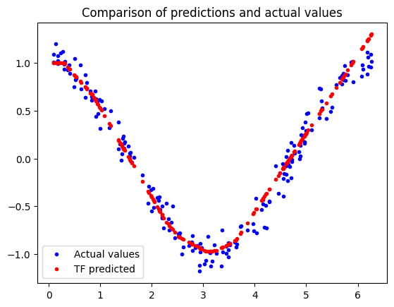
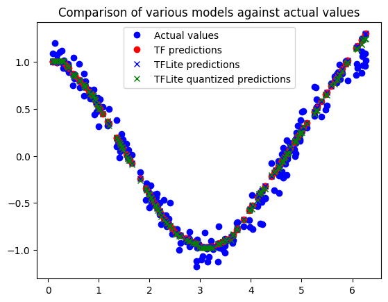

<a href="https://colab.research.google.com/github/ucl-casa-ce/casa0018/blob/main/Week4/CASA0018_4_1_train_hello_world_model.ipynb" target="_parent"></a>

# Train a Simple TensorFlow Lite for Microcontrollers model

This notebook demonstrates the process of training a 2.5 kB model using TensorFlow and converting it for use with TensorFlow Lite for Microcontrollers.

Deep learning networks learn to model patterns in underlying data. Here, we're going to train a network to model data generated by a [sine](https://en.wikipedia.org/wiki/Sine) function. This will result in a model that can take a value, `x`, and predict its sine, `y`.

The model created in this notebook is used in the [hello_world](https://github.com/tensorflow/tensorflow/tree/master/tensorflow/lite/micro/examples/hello_world) example for [TensorFlow Lite for MicroControllers](https://www.tensorflow.org/lite/microcontrollers/overview).

<table class="tfo-notebook-buttons" align="left">
  <td>
    <a target="_blank" href="https://colab.research.google.com/github/tensorflow/tensorflow/blob/master/tensorflow/lite/micro/examples/hello_world/train/train_hello_world_model.ipynb">Run in Google Colab</a>
  </td>
  <td>
    <a target="_blank" href="https://github.com/tensorflow/tensorflow/blob/master/tensorflow/lite/micro/examples/hello_world/train/train_hello_world_model.ipynb">View source on GitHub</a>
  </td>
</table>

## Configure Defaults
Define some variables to point to file locations.


```python
# Define paths to model files
import os
MODELS_DIR = 'models/'
if not os.path.exists(MODELS_DIR):
    os.mkdir(MODELS_DIR)
MODEL_TF = MODELS_DIR + 'model.keras'
MODEL_NO_QUANT_TFLITE = MODELS_DIR + 'model_no_quant.tflite'
MODEL_TFLITE = MODELS_DIR + 'model.tflite'
MODEL_TFLITE_MICRO = MODELS_DIR + 'model.cc'
```

## Setup Environment

Import Dependencies and give them some aliases so that they are easier to read in the code.

We set a random number seed so that you can get repeatable model results or you can tweak it to vary the model output if you want to experiment. Note - if you set a different seed number your graphs and results will look different!


```python
# TensorFlow is an open source machine learning library
import tensorflow as tf

# Keras is TensorFlow's high-level API for deep learning
from tensorflow import keras
# Numpy is a math library
import numpy as np
# Pandas is a data manipulation library
import pandas as pd
# Matplotlib is a graphing library
import matplotlib.pyplot as plt
# Math is Python's math library
import math

# Set seed for experiment reproducibility
seed = 1337
np.random.seed(seed)
tf.random.set_seed(seed)
```

## Creating a Dataset

### 1. Generate Data

The code in the following cell will generate a set of random `x` values, calculate their sine values, and display them on a graph.

Note that we shuffle the values so that they are not in order which makes the splitting of training, validation and test data easier at the next stage.


```python
# Number of sample datapoints
SAMPLES = 1000

# Generate a uniformly distributed set of random numbers in the range from
# 0 to 2π, which covers a complete sine wave oscillation
x_values = np.random.uniform(
    low=0, high=2*math.pi, size=SAMPLES).astype(np.float32)

# Shuffle the values to guarantee they're not in order
np.random.shuffle(x_values)

# Calculate the corresponding sine values
y_values = np.cos(x_values).astype(np.float32)

# Plot our data. The 'b.' argument tells the library to print blue dots.
plt.plot(x_values, y_values, 'b.')
plt.show()
```


    

    


### 2. Add Noise
Since it was generated directly by the sine function, our data fits a nice, smooth curve.

However, machine learning models are good at extracting underlying meaning from messy, real world data. To demonstrate this, we can add some noise to our data to approximate something more life-like.

In the following cell, we'll add some random noise to each value, then draw a new graph:


```python
# Add a small random number to each y value
y_values += 0.1 * np.random.randn(*y_values.shape)

# Plot our data
plt.plot(x_values, y_values, 'b.')
plt.show()
```


    

    


### 3. Split the Data
We now have a noisy dataset that approximates real world data. We'll be using this to train our model.

To evaluate the accuracy of the model we train, we'll need to compare its predictions to real data and check how well they match up. This evaluation happens during training (where it is referred to as validation) and after training (referred to as testing).

The data is split as follows:
  1. Training: 60%
  2. Validation: 20%
  3. Testing: 20%

The following code will split our data and then plots each set as a different color:


```python
# We'll use 60% of our data for training and 20% for testing. The remaining 20%
# will be used for validation. Calculate the indices of each section.
TRAIN_SPLIT =  int(0.6 * SAMPLES)
TEST_SPLIT = int(0.2 * SAMPLES + TRAIN_SPLIT)

# Use np.split to chop our data into three parts.
# The second argument to np.split is an array of indices where the data will be
# split. We provide two indices, so the data will be divided into three chunks.
x_train, x_test, x_validate = np.split(x_values, [TRAIN_SPLIT, TEST_SPLIT])
y_train, y_test, y_validate = np.split(y_values, [TRAIN_SPLIT, TEST_SPLIT])

# Double check that our splits add up correctly
assert (x_train.size + x_validate.size + x_test.size) ==  SAMPLES

# Plot the data in each partition in different colors:
plt.plot(x_train, y_train, 'b.', label="Train")
plt.plot(x_test, y_test, 'r.', label="Test")
plt.plot(x_validate, y_validate, 'y.', label="Validate")
plt.legend()
plt.show()
```


    

    


## Training

### 1. Design the Model
We're going to build a simple neural network model that will take an input value (in this case, `x`) and use it to predict a numeric output value (the sine of `x`). This type of problem is called a _regression_. It will use _layers_ of _neurons_ to attempt to learn any patterns underlying the training data, so it can make predictions.

To begin with, we'll define two layers. The first layer takes a single input (our `x` value) and runs it through 8 neurons. Based on this input, each neuron will become _activated_ to a certain degree based on its internal state (its _weight_ and _bias_ values). A neuron's degree of activation is expressed as a number. Remember:
**activation = activation_function((input * weight) + bias)** - but we don't see this here since it is handled under the hood by Keras.

The activation numbers from our first layer will be fed as inputs to our second layer, which is a single neuron. It will apply its own weights and bias to these inputs and calculate its own activation, which will be output as our `y` value.

The code in the following cell defines our model using [Keras](https://www.tensorflow.org/guide/keras), TensorFlow's high-level API for creating deep learning networks.


```python
# We'll use Keras to create a simple model architecture
model_1 = tf.keras.Sequential()

# First layer takes a scalar input and feeds it through 8 "neurons". The
# neurons decide whether to activate based on the 'relu' activation function.
model_1.add(keras.layers.Dense(32, activation='relu', input_shape=(1,)))

# Final layer is a single neuron, since we want to output a single value
model_1.add(keras.layers.Dense(1))
```

Once the network is defined, we _compile_ it, specifying parameters that determine how it will be trained:


```python
# Compile the model using the standard 'adam' optimizer and
# the mean squared error or 'mse' loss function for regression and mean abs error as a metric.
model_1.compile(optimizer='rmsprop', loss='mse', metrics=['mae'])
model_1.summary()
```

    Model: "sequential"
    _________________________________________________________________
     Layer (type)                Output Shape              Param #   
    =================================================================
     dense (Dense)               (None, 32)                64        
                                                                     
     dense_1 (Dense)             (None, 1)                 33        
                                                                     
    =================================================================
    Total params: 97
    Trainable params: 97
    Non-trainable params: 0
    _________________________________________________________________
    

### 2. Train the Model
Once we've defined the model, we can use our data to _train_ it. Training involves passing an `x` value into the neural network, checking how far the network's output deviates from the expected `y` value, and adjusting the neurons' weights and biases so that the output is more likely to be correct the next time.

Training runs this process on the full dataset multiple times, and each full run-through is known as an epoch. The number of **_epochs_** to run during training is a parameter we can set.

During each epoch, data is run through the network in multiple batches. For each batch, several pieces of data are passed into the network, producing output values. These outputs' correctness is measured in aggregate and the network's weights and biases are adjusted accordingly, once per batch. The **_batch size_** is also a parameter we can set.

The code in the following cell **uses the `x` and `y` values from our training data to train the model. It runs for 500 _epochs_, with 64 pieces of data in each _batch_. We also pass in some data for _validation_**. As you will see when you run the cell, training can take a while to complete:


```python
# Train the model on our training data while validating on our validation set
history_1 = model_1.fit(x_train, y_train, epochs=400, batch_size=32,
                        validation_data=(x_validate, y_validate))
```

    Epoch 1/400
    19/19 [==============================] - 1s 11ms/step - loss: 0.5163 - mae: 0.6428 - val_loss: 0.4524 - val_mae: 0.5933
    Epoch 2/400
    19/19 [==============================] - 0s 6ms/step - loss: 0.5146 - mae: 0.6437 - val_loss: 0.4522 - val_mae: 0.5932
    Epoch 3/400
    19/19 [==============================] - 0s 5ms/step - loss: 0.5162 - mae: 0.6441 - val_loss: 0.4517 - val_mae: 0.5929
    Epoch 4/400
    19/19 [==============================] - 0s 5ms/step - loss: 0.5130 - mae: 0.6421 - val_loss: 0.4518 - val_mae: 0.5928
    Epoch 5/400
    19/19 [==============================] - 0s 5ms/step - loss: 0.5109 - mae: 0.6405 - val_loss: 0.4502 - val_mae: 0.5918
    Epoch 6/400
    19/19 [==============================] - 0s 5ms/step - loss: 0.5080 - mae: 0.6383 - val_loss: 0.4451 - val_mae: 0.5890
    Epoch 7/400
    19/19 [==============================] - 0s 5ms/step - loss: 0.5029 - mae: 0.6356 - val_loss: 0.4430 - val_mae: 0.5862
    Epoch 8/400
    19/19 [==============================] - 0s 6ms/step - loss: 0.4999 - mae: 0.6337 - val_loss: 0.4381 - val_mae: 0.5839
    Epoch 9/400
    19/19 [==============================] - 0s 5ms/step - loss: 0.4968 - mae: 0.6314 - val_loss: 0.4358 - val_mae: 0.5823
    Epoch 10/400
    19/19 [==============================] - 0s 5ms/step - loss: 0.4938 - mae: 0.6298 - val_loss: 0.4338 - val_mae: 0.5809
    Epoch 11/400
    19/19 [==============================] - 0s 5ms/step - loss: 0.4911 - mae: 0.6284 - val_loss: 0.4321 - val_mae: 0.5800
    Epoch 12/400
    19/19 [==============================] - 0s 5ms/step - loss: 0.4876 - mae: 0.6258 - val_loss: 0.4298 - val_mae: 0.5784
    Epoch 13/400
    19/19 [==============================] - 0s 5ms/step - loss: 0.4863 - mae: 0.6248 - val_loss: 0.4268 - val_mae: 0.5763
    Epoch 14/400
    19/19 [==============================] - 0s 5ms/step - loss: 0.4827 - mae: 0.6211 - val_loss: 0.4251 - val_mae: 0.5752
    Epoch 15/400
    19/19 [==============================] - 0s 5ms/step - loss: 0.4785 - mae: 0.6197 - val_loss: 0.4228 - val_mae: 0.5737
    Epoch 16/400
    19/19 [==============================] - 0s 5ms/step - loss: 0.4756 - mae: 0.6179 - val_loss: 0.4204 - val_mae: 0.5719
    Epoch 17/400
    19/19 [==============================] - 0s 5ms/step - loss: 0.4712 - mae: 0.6154 - val_loss: 0.4168 - val_mae: 0.5692
    Epoch 18/400
    19/19 [==============================] - 0s 5ms/step - loss: 0.4687 - mae: 0.6137 - val_loss: 0.4134 - val_mae: 0.5673
    Epoch 19/400
    19/19 [==============================] - 0s 5ms/step - loss: 0.4660 - mae: 0.6122 - val_loss: 0.4104 - val_mae: 0.5653
    Epoch 20/400
    19/19 [==============================] - 0s 5ms/step - loss: 0.4604 - mae: 0.6074 - val_loss: 0.4081 - val_mae: 0.5638
    Epoch 21/400
    19/19 [==============================] - 0s 5ms/step - loss: 0.4565 - mae: 0.6054 - val_loss: 0.4041 - val_mae: 0.5607
    Epoch 22/400
    19/19 [==============================] - 0s 5ms/step - loss: 0.4499 - mae: 0.6014 - val_loss: 0.4023 - val_mae: 0.5593
    Epoch 23/400
    19/19 [==============================] - 0s 5ms/step - loss: 0.4479 - mae: 0.5993 - val_loss: 0.3963 - val_mae: 0.5557
    Epoch 24/400
    19/19 [==============================] - 0s 5ms/step - loss: 0.4400 - mae: 0.5935 - val_loss: 0.4009 - val_mae: 0.5563
    Epoch 25/400
    19/19 [==============================] - 0s 5ms/step - loss: 0.4378 - mae: 0.5914 - val_loss: 0.3916 - val_mae: 0.5516
    Epoch 26/400
    19/19 [==============================] - 0s 6ms/step - loss: 0.4330 - mae: 0.5880 - val_loss: 0.3844 - val_mae: 0.5470
    Epoch 27/400
    19/19 [==============================] - 0s 5ms/step - loss: 0.4294 - mae: 0.5862 - val_loss: 0.3807 - val_mae: 0.5448
    Epoch 28/400
    19/19 [==============================] - 0s 5ms/step - loss: 0.4231 - mae: 0.5827 - val_loss: 0.3779 - val_mae: 0.5428
    Epoch 29/400
    19/19 [==============================] - 0s 6ms/step - loss: 0.4195 - mae: 0.5797 - val_loss: 0.3735 - val_mae: 0.5393
    Epoch 30/400
    19/19 [==============================] - 0s 6ms/step - loss: 0.4138 - mae: 0.5744 - val_loss: 0.3697 - val_mae: 0.5371
    Epoch 31/400
    19/19 [==============================] - 0s 5ms/step - loss: 0.4095 - mae: 0.5735 - val_loss: 0.3656 - val_mae: 0.5339
    Epoch 32/400
    19/19 [==============================] - 0s 6ms/step - loss: 0.4047 - mae: 0.5692 - val_loss: 0.3615 - val_mae: 0.5312
    Epoch 33/400
    19/19 [==============================] - 0s 6ms/step - loss: 0.3974 - mae: 0.5637 - val_loss: 0.3601 - val_mae: 0.5292
    Epoch 34/400
    19/19 [==============================] - 0s 6ms/step - loss: 0.3966 - mae: 0.5649 - val_loss: 0.3535 - val_mae: 0.5254
    Epoch 35/400
    19/19 [==============================] - 0s 6ms/step - loss: 0.3884 - mae: 0.5577 - val_loss: 0.3484 - val_mae: 0.5212
    Epoch 36/400
    19/19 [==============================] - 0s 6ms/step - loss: 0.3837 - mae: 0.5547 - val_loss: 0.3456 - val_mae: 0.5192
    Epoch 37/400
    19/19 [==============================] - 0s 6ms/step - loss: 0.3782 - mae: 0.5507 - val_loss: 0.3393 - val_mae: 0.5144
    Epoch 38/400
    19/19 [==============================] - 0s 6ms/step - loss: 0.3731 - mae: 0.5468 - val_loss: 0.3347 - val_mae: 0.5111
    Epoch 39/400
    19/19 [==============================] - 0s 6ms/step - loss: 0.3678 - mae: 0.5427 - val_loss: 0.3300 - val_mae: 0.5076
    Epoch 40/400
    19/19 [==============================] - 0s 6ms/step - loss: 0.3615 - mae: 0.5385 - val_loss: 0.3257 - val_mae: 0.5040
    Epoch 41/400
    19/19 [==============================] - 0s 6ms/step - loss: 0.3558 - mae: 0.5331 - val_loss: 0.3212 - val_mae: 0.5010
    Epoch 42/400
    19/19 [==============================] - 0s 6ms/step - loss: 0.3489 - mae: 0.5279 - val_loss: 0.3146 - val_mae: 0.4958
    Epoch 43/400
    19/19 [==============================] - 0s 6ms/step - loss: 0.3430 - mae: 0.5240 - val_loss: 0.3092 - val_mae: 0.4915
    Epoch 44/400
    19/19 [==============================] - 0s 6ms/step - loss: 0.3385 - mae: 0.5206 - val_loss: 0.3049 - val_mae: 0.4878
    Epoch 45/400
    19/19 [==============================] - 0s 6ms/step - loss: 0.3315 - mae: 0.5144 - val_loss: 0.3033 - val_mae: 0.4860
    Epoch 46/400
    19/19 [==============================] - 0s 6ms/step - loss: 0.3268 - mae: 0.5115 - val_loss: 0.2959 - val_mae: 0.4811
    Epoch 47/400
    19/19 [==============================] - 0s 7ms/step - loss: 0.3205 - mae: 0.5045 - val_loss: 0.2910 - val_mae: 0.4771
    Epoch 48/400
    19/19 [==============================] - 0s 7ms/step - loss: 0.3141 - mae: 0.5020 - val_loss: 0.2864 - val_mae: 0.4732
    Epoch 49/400
    19/19 [==============================] - 0s 7ms/step - loss: 0.3091 - mae: 0.4979 - val_loss: 0.2820 - val_mae: 0.4692
    Epoch 50/400
    19/19 [==============================] - 0s 7ms/step - loss: 0.3037 - mae: 0.4921 - val_loss: 0.2756 - val_mae: 0.4641
    Epoch 51/400
    19/19 [==============================] - 0s 7ms/step - loss: 0.2973 - mae: 0.4870 - val_loss: 0.2770 - val_mae: 0.4628
    Epoch 52/400
    19/19 [==============================] - 0s 7ms/step - loss: 0.2895 - mae: 0.4802 - val_loss: 0.2703 - val_mae: 0.4568
    Epoch 53/400
    19/19 [==============================] - 0s 7ms/step - loss: 0.2838 - mae: 0.4740 - val_loss: 0.2620 - val_mae: 0.4517
    Epoch 54/400
    19/19 [==============================] - 0s 7ms/step - loss: 0.2790 - mae: 0.4709 - val_loss: 0.2537 - val_mae: 0.4452
    Epoch 55/400
    19/19 [==============================] - 0s 7ms/step - loss: 0.2721 - mae: 0.4664 - val_loss: 0.2488 - val_mae: 0.4406
    Epoch 56/400
    19/19 [==============================] - 0s 7ms/step - loss: 0.2662 - mae: 0.4609 - val_loss: 0.2434 - val_mae: 0.4359
    Epoch 57/400
    19/19 [==============================] - 0s 7ms/step - loss: 0.2599 - mae: 0.4551 - val_loss: 0.2385 - val_mae: 0.4312
    Epoch 58/400
    19/19 [==============================] - 0s 7ms/step - loss: 0.2516 - mae: 0.4472 - val_loss: 0.2333 - val_mae: 0.4258
    Epoch 59/400
    19/19 [==============================] - 0s 8ms/step - loss: 0.2469 - mae: 0.4429 - val_loss: 0.2262 - val_mae: 0.4198
    Epoch 60/400
    19/19 [==============================] - 0s 7ms/step - loss: 0.2388 - mae: 0.4355 - val_loss: 0.2217 - val_mae: 0.4149
    Epoch 61/400
    19/19 [==============================] - 0s 8ms/step - loss: 0.2333 - mae: 0.4301 - val_loss: 0.2147 - val_mae: 0.4088
    Epoch 62/400
    19/19 [==============================] - 0s 7ms/step - loss: 0.2247 - mae: 0.4215 - val_loss: 0.2206 - val_mae: 0.4081
    Epoch 63/400
    19/19 [==============================] - 0s 8ms/step - loss: 0.2204 - mae: 0.4172 - val_loss: 0.2050 - val_mae: 0.3985
    Epoch 64/400
    19/19 [==============================] - 0s 7ms/step - loss: 0.2134 - mae: 0.4116 - val_loss: 0.2003 - val_mae: 0.3931
    Epoch 65/400
    19/19 [==============================] - 0s 7ms/step - loss: 0.2063 - mae: 0.4027 - val_loss: 0.1915 - val_mae: 0.3857
    Epoch 66/400
    19/19 [==============================] - 0s 7ms/step - loss: 0.2011 - mae: 0.3998 - val_loss: 0.1860 - val_mae: 0.3802
    Epoch 67/400
    19/19 [==============================] - 0s 7ms/step - loss: 0.1945 - mae: 0.3926 - val_loss: 0.1805 - val_mae: 0.3744
    Epoch 68/400
    19/19 [==============================] - 0s 8ms/step - loss: 0.1886 - mae: 0.3860 - val_loss: 0.1753 - val_mae: 0.3686
    Epoch 69/400
    19/19 [==============================] - 0s 7ms/step - loss: 0.1820 - mae: 0.3784 - val_loss: 0.1719 - val_mae: 0.3637
    Epoch 70/400
    19/19 [==============================] - 0s 8ms/step - loss: 0.1775 - mae: 0.3736 - val_loss: 0.1659 - val_mae: 0.3579
    Epoch 71/400
    19/19 [==============================] - 0s 7ms/step - loss: 0.1699 - mae: 0.3660 - val_loss: 0.1615 - val_mae: 0.3516
    Epoch 72/400
    19/19 [==============================] - 0s 7ms/step - loss: 0.1655 - mae: 0.3611 - val_loss: 0.1559 - val_mae: 0.3464
    Epoch 73/400
    19/19 [==============================] - 0s 7ms/step - loss: 0.1591 - mae: 0.3538 - val_loss: 0.1498 - val_mae: 0.3398
    Epoch 74/400
    19/19 [==============================] - 0s 7ms/step - loss: 0.1541 - mae: 0.3473 - val_loss: 0.1461 - val_mae: 0.3347
    Epoch 75/400
    19/19 [==============================] - 0s 7ms/step - loss: 0.1487 - mae: 0.3417 - val_loss: 0.1395 - val_mae: 0.3278
    Epoch 76/400
    19/19 [==============================] - 0s 8ms/step - loss: 0.1414 - mae: 0.3303 - val_loss: 0.1342 - val_mae: 0.3212
    Epoch 77/400
    19/19 [==============================] - 0s 7ms/step - loss: 0.1364 - mae: 0.3247 - val_loss: 0.1297 - val_mae: 0.3149
    Epoch 78/400
    19/19 [==============================] - 0s 8ms/step - loss: 0.1316 - mae: 0.3194 - val_loss: 0.1256 - val_mae: 0.3092
    Epoch 79/400
    19/19 [==============================] - 0s 7ms/step - loss: 0.1261 - mae: 0.3131 - val_loss: 0.1202 - val_mae: 0.3025
    Epoch 80/400
    19/19 [==============================] - 0s 7ms/step - loss: 0.1209 - mae: 0.3056 - val_loss: 0.1167 - val_mae: 0.2968
    Epoch 81/400
    19/19 [==============================] - 0s 8ms/step - loss: 0.1157 - mae: 0.2991 - val_loss: 0.1103 - val_mae: 0.2895
    Epoch 82/400
    19/19 [==============================] - 0s 7ms/step - loss: 0.1104 - mae: 0.2911 - val_loss: 0.1055 - val_mae: 0.2829
    Epoch 83/400
    19/19 [==============================] - 0s 7ms/step - loss: 0.1056 - mae: 0.2849 - val_loss: 0.1040 - val_mae: 0.2782
    Epoch 84/400
    19/19 [==============================] - 0s 7ms/step - loss: 0.1008 - mae: 0.2769 - val_loss: 0.0963 - val_mae: 0.2699
    Epoch 85/400
    19/19 [==============================] - 0s 7ms/step - loss: 0.0965 - mae: 0.2716 - val_loss: 0.0925 - val_mae: 0.2637
    Epoch 86/400
    19/19 [==============================] - 0s 7ms/step - loss: 0.0915 - mae: 0.2624 - val_loss: 0.0903 - val_mae: 0.2585
    Epoch 87/400
    19/19 [==============================] - 0s 7ms/step - loss: 0.0877 - mae: 0.2579 - val_loss: 0.0844 - val_mae: 0.2515
    Epoch 88/400
    19/19 [==============================] - 0s 7ms/step - loss: 0.0843 - mae: 0.2523 - val_loss: 0.0836 - val_mae: 0.2476
    Epoch 89/400
    19/19 [==============================] - 0s 7ms/step - loss: 0.0786 - mae: 0.2428 - val_loss: 0.0800 - val_mae: 0.2415
    Epoch 90/400
    19/19 [==============================] - 0s 8ms/step - loss: 0.0740 - mae: 0.2345 - val_loss: 0.0724 - val_mae: 0.2313
    Epoch 91/400
    19/19 [==============================] - 0s 7ms/step - loss: 0.0706 - mae: 0.2269 - val_loss: 0.0684 - val_mae: 0.2247
    Epoch 92/400
    19/19 [==============================] - 0s 7ms/step - loss: 0.0670 - mae: 0.2231 - val_loss: 0.0664 - val_mae: 0.2187
    Epoch 93/400
    19/19 [==============================] - 0s 8ms/step - loss: 0.0630 - mae: 0.2148 - val_loss: 0.0639 - val_mae: 0.2131
    Epoch 94/400
    19/19 [==============================] - 0s 7ms/step - loss: 0.0593 - mae: 0.2076 - val_loss: 0.0580 - val_mae: 0.2056
    Epoch 95/400
    19/19 [==============================] - 0s 8ms/step - loss: 0.0566 - mae: 0.2021 - val_loss: 0.0550 - val_mae: 0.1994
    Epoch 96/400
    19/19 [==============================] - 0s 7ms/step - loss: 0.0533 - mae: 0.1956 - val_loss: 0.0532 - val_mae: 0.1951
    Epoch 97/400
    19/19 [==============================] - 0s 7ms/step - loss: 0.0492 - mae: 0.1876 - val_loss: 0.0489 - val_mae: 0.1863
    Epoch 98/400
    19/19 [==============================] - 0s 8ms/step - loss: 0.0460 - mae: 0.1808 - val_loss: 0.0490 - val_mae: 0.1860
    Epoch 99/400
    19/19 [==============================] - 0s 8ms/step - loss: 0.0434 - mae: 0.1759 - val_loss: 0.0431 - val_mae: 0.1748
    Epoch 100/400
    19/19 [==============================] - 0s 7ms/step - loss: 0.0416 - mae: 0.1710 - val_loss: 0.0410 - val_mae: 0.1688
    Epoch 101/400
    19/19 [==============================] - 0s 7ms/step - loss: 0.0386 - mae: 0.1646 - val_loss: 0.0384 - val_mae: 0.1635
    Epoch 102/400
    19/19 [==============================] - 0s 8ms/step - loss: 0.0366 - mae: 0.1584 - val_loss: 0.0390 - val_mae: 0.1626
    Epoch 103/400
    19/19 [==============================] - 0s 8ms/step - loss: 0.0350 - mae: 0.1565 - val_loss: 0.0343 - val_mae: 0.1544
    Epoch 104/400
    19/19 [==============================] - 0s 8ms/step - loss: 0.0330 - mae: 0.1517 - val_loss: 0.0327 - val_mae: 0.1504
    Epoch 105/400
    19/19 [==============================] - 0s 7ms/step - loss: 0.0315 - mae: 0.1470 - val_loss: 0.0319 - val_mae: 0.1478
    Epoch 106/400
    19/19 [==============================] - 0s 8ms/step - loss: 0.0302 - mae: 0.1442 - val_loss: 0.0296 - val_mae: 0.1429
    Epoch 107/400
    19/19 [==============================] - 0s 7ms/step - loss: 0.0292 - mae: 0.1419 - val_loss: 0.0281 - val_mae: 0.1392
    Epoch 108/400
    19/19 [==============================] - 0s 7ms/step - loss: 0.0276 - mae: 0.1373 - val_loss: 0.0267 - val_mae: 0.1355
    Epoch 109/400
    19/19 [==============================] - 0s 7ms/step - loss: 0.0267 - mae: 0.1338 - val_loss: 0.0264 - val_mae: 0.1342
    Epoch 110/400
    19/19 [==============================] - 0s 7ms/step - loss: 0.0251 - mae: 0.1304 - val_loss: 0.0268 - val_mae: 0.1356
    Epoch 111/400
    19/19 [==============================] - 0s 8ms/step - loss: 0.0248 - mae: 0.1295 - val_loss: 0.0243 - val_mae: 0.1289
    Epoch 112/400
    19/19 [==============================] - 0s 7ms/step - loss: 0.0238 - mae: 0.1265 - val_loss: 0.0262 - val_mae: 0.1315
    Epoch 113/400
    19/19 [==============================] - 0s 8ms/step - loss: 0.0236 - mae: 0.1263 - val_loss: 0.0221 - val_mae: 0.1229
    Epoch 114/400
    19/19 [==============================] - 0s 7ms/step - loss: 0.0222 - mae: 0.1204 - val_loss: 0.0219 - val_mae: 0.1223
    Epoch 115/400
    19/19 [==============================] - 0s 7ms/step - loss: 0.0214 - mae: 0.1201 - val_loss: 0.0221 - val_mae: 0.1229
    Epoch 116/400
    19/19 [==============================] - 0s 8ms/step - loss: 0.0211 - mae: 0.1184 - val_loss: 0.0215 - val_mae: 0.1212
    Epoch 117/400
    19/19 [==============================] - 0s 7ms/step - loss: 0.0208 - mae: 0.1176 - val_loss: 0.0222 - val_mae: 0.1229
    Epoch 118/400
    19/19 [==============================] - 0s 8ms/step - loss: 0.0205 - mae: 0.1166 - val_loss: 0.0190 - val_mae: 0.1134
    Epoch 119/400
    19/19 [==============================] - 0s 7ms/step - loss: 0.0205 - mae: 0.1144 - val_loss: 0.0199 - val_mae: 0.1163
    Epoch 120/400
    19/19 [==============================] - 0s 7ms/step - loss: 0.0195 - mae: 0.1110 - val_loss: 0.0193 - val_mae: 0.1119
    Epoch 121/400
    19/19 [==============================] - 0s 7ms/step - loss: 0.0194 - mae: 0.1110 - val_loss: 0.0181 - val_mae: 0.1098
    Epoch 122/400
    19/19 [==============================] - 0s 7ms/step - loss: 0.0193 - mae: 0.1105 - val_loss: 0.0180 - val_mae: 0.1086
    Epoch 123/400
    19/19 [==============================] - 0s 8ms/step - loss: 0.0191 - mae: 0.1101 - val_loss: 0.0185 - val_mae: 0.1118
    Epoch 124/400
    19/19 [==============================] - 0s 7ms/step - loss: 0.0185 - mae: 0.1094 - val_loss: 0.0196 - val_mae: 0.1150
    Epoch 125/400
    19/19 [==============================] - 0s 8ms/step - loss: 0.0189 - mae: 0.1103 - val_loss: 0.0178 - val_mae: 0.1097
    Epoch 126/400
    19/19 [==============================] - 0s 8ms/step - loss: 0.0184 - mae: 0.1076 - val_loss: 0.0165 - val_mae: 0.1047
    Epoch 127/400
    19/19 [==============================] - 0s 7ms/step - loss: 0.0185 - mae: 0.1080 - val_loss: 0.0165 - val_mae: 0.1049
    Epoch 128/400
    19/19 [==============================] - 0s 8ms/step - loss: 0.0176 - mae: 0.1064 - val_loss: 0.0162 - val_mae: 0.1037
    Epoch 129/400
    19/19 [==============================] - 0s 7ms/step - loss: 0.0183 - mae: 0.1080 - val_loss: 0.0165 - val_mae: 0.1032
    Epoch 130/400
    19/19 [==============================] - 0s 7ms/step - loss: 0.0178 - mae: 0.1052 - val_loss: 0.0157 - val_mae: 0.1019
    Epoch 131/400
    19/19 [==============================] - 0s 8ms/step - loss: 0.0172 - mae: 0.1056 - val_loss: 0.0216 - val_mae: 0.1191
    Epoch 132/400
    19/19 [==============================] - 0s 7ms/step - loss: 0.0177 - mae: 0.1071 - val_loss: 0.0181 - val_mae: 0.1101
    Epoch 133/400
    19/19 [==============================] - 0s 7ms/step - loss: 0.0172 - mae: 0.1042 - val_loss: 0.0154 - val_mae: 0.1005
    Epoch 134/400
    19/19 [==============================] - 0s 7ms/step - loss: 0.0170 - mae: 0.1035 - val_loss: 0.0152 - val_mae: 0.0997
    Epoch 135/400
    19/19 [==============================] - 0s 7ms/step - loss: 0.0171 - mae: 0.1034 - val_loss: 0.0166 - val_mae: 0.1020
    Epoch 136/400
    19/19 [==============================] - 0s 7ms/step - loss: 0.0167 - mae: 0.1021 - val_loss: 0.0150 - val_mae: 0.0992
    Epoch 137/400
    19/19 [==============================] - 0s 7ms/step - loss: 0.0177 - mae: 0.1057 - val_loss: 0.0162 - val_mae: 0.1042
    Epoch 138/400
    19/19 [==============================] - 0s 8ms/step - loss: 0.0176 - mae: 0.1064 - val_loss: 0.0151 - val_mae: 0.0991
    Epoch 139/400
    19/19 [==============================] - 0s 8ms/step - loss: 0.0166 - mae: 0.1024 - val_loss: 0.0148 - val_mae: 0.0980
    Epoch 140/400
    19/19 [==============================] - 0s 8ms/step - loss: 0.0169 - mae: 0.1033 - val_loss: 0.0147 - val_mae: 0.0982
    Epoch 141/400
    19/19 [==============================] - 0s 8ms/step - loss: 0.0172 - mae: 0.1047 - val_loss: 0.0147 - val_mae: 0.0983
    Epoch 142/400
    19/19 [==============================] - 0s 7ms/step - loss: 0.0167 - mae: 0.1038 - val_loss: 0.0155 - val_mae: 0.0991
    Epoch 143/400
    19/19 [==============================] - 0s 8ms/step - loss: 0.0170 - mae: 0.1032 - val_loss: 0.0247 - val_mae: 0.1269
    Epoch 144/400
    19/19 [==============================] - 0s 7ms/step - loss: 0.0167 - mae: 0.1014 - val_loss: 0.0146 - val_mae: 0.0975
    Epoch 145/400
    19/19 [==============================] - 0s 8ms/step - loss: 0.0168 - mae: 0.1031 - val_loss: 0.0153 - val_mae: 0.1007
    Epoch 146/400
    19/19 [==============================] - 0s 7ms/step - loss: 0.0168 - mae: 0.1029 - val_loss: 0.0202 - val_mae: 0.1122
    Epoch 147/400
    19/19 [==============================] - 0s 8ms/step - loss: 0.0166 - mae: 0.1033 - val_loss: 0.0221 - val_mae: 0.1198
    Epoch 148/400
    19/19 [==============================] - 0s 7ms/step - loss: 0.0166 - mae: 0.1025 - val_loss: 0.0202 - val_mae: 0.1150
    Epoch 149/400
    19/19 [==============================] - 0s 8ms/step - loss: 0.0172 - mae: 0.1033 - val_loss: 0.0152 - val_mae: 0.0979
    Epoch 150/400
    19/19 [==============================] - 0s 8ms/step - loss: 0.0171 - mae: 0.1035 - val_loss: 0.0154 - val_mae: 0.0984
    Epoch 151/400
    19/19 [==============================] - 0s 7ms/step - loss: 0.0164 - mae: 0.1021 - val_loss: 0.0141 - val_mae: 0.0962
    Epoch 152/400
    19/19 [==============================] - 0s 7ms/step - loss: 0.0166 - mae: 0.1026 - val_loss: 0.0158 - val_mae: 0.1023
    Epoch 153/400
    19/19 [==============================] - 0s 7ms/step - loss: 0.0167 - mae: 0.1027 - val_loss: 0.0145 - val_mae: 0.0976
    Epoch 154/400
    19/19 [==============================] - 0s 8ms/step - loss: 0.0167 - mae: 0.1031 - val_loss: 0.0141 - val_mae: 0.0957
    Epoch 155/400
    19/19 [==============================] - 0s 7ms/step - loss: 0.0173 - mae: 0.1041 - val_loss: 0.0151 - val_mae: 0.0974
    Epoch 156/400
    19/19 [==============================] - 0s 8ms/step - loss: 0.0167 - mae: 0.1035 - val_loss: 0.0160 - val_mae: 0.1031
    Epoch 157/400
    19/19 [==============================] - 0s 7ms/step - loss: 0.0162 - mae: 0.1015 - val_loss: 0.0144 - val_mae: 0.0972
    Epoch 158/400
    19/19 [==============================] - 0s 7ms/step - loss: 0.0173 - mae: 0.1031 - val_loss: 0.0140 - val_mae: 0.0954
    Epoch 159/400
    19/19 [==============================] - 0s 7ms/step - loss: 0.0162 - mae: 0.1010 - val_loss: 0.0167 - val_mae: 0.1051
    Epoch 160/400
    19/19 [==============================] - 0s 7ms/step - loss: 0.0170 - mae: 0.1037 - val_loss: 0.0141 - val_mae: 0.0964
    Epoch 161/400
    19/19 [==============================] - 0s 8ms/step - loss: 0.0164 - mae: 0.1012 - val_loss: 0.0155 - val_mae: 0.1013
    Epoch 162/400
    19/19 [==============================] - 0s 7ms/step - loss: 0.0170 - mae: 0.1037 - val_loss: 0.0152 - val_mae: 0.1004
    Epoch 163/400
    19/19 [==============================] - 0s 8ms/step - loss: 0.0167 - mae: 0.1019 - val_loss: 0.0140 - val_mae: 0.0958
    Epoch 164/400
    19/19 [==============================] - 0s 7ms/step - loss: 0.0169 - mae: 0.1027 - val_loss: 0.0144 - val_mae: 0.0961
    Epoch 165/400
    19/19 [==============================] - 0s 8ms/step - loss: 0.0166 - mae: 0.1028 - val_loss: 0.0142 - val_mae: 0.0959
    Epoch 166/400
    19/19 [==============================] - 0s 7ms/step - loss: 0.0162 - mae: 0.1015 - val_loss: 0.0146 - val_mae: 0.0980
    Epoch 167/400
    19/19 [==============================] - 0s 7ms/step - loss: 0.0165 - mae: 0.1016 - val_loss: 0.0156 - val_mae: 0.1017
    Epoch 168/400
    19/19 [==============================] - 0s 7ms/step - loss: 0.0167 - mae: 0.1030 - val_loss: 0.0147 - val_mae: 0.0962
    Epoch 169/400
    19/19 [==============================] - 0s 8ms/step - loss: 0.0171 - mae: 0.1045 - val_loss: 0.0139 - val_mae: 0.0949
    Epoch 170/400
    19/19 [==============================] - 0s 7ms/step - loss: 0.0163 - mae: 0.1014 - val_loss: 0.0147 - val_mae: 0.0983
    Epoch 171/400
    19/19 [==============================] - 0s 7ms/step - loss: 0.0172 - mae: 0.1042 - val_loss: 0.0139 - val_mae: 0.0949
    Epoch 172/400
    19/19 [==============================] - 0s 7ms/step - loss: 0.0166 - mae: 0.1018 - val_loss: 0.0166 - val_mae: 0.1046
    Epoch 173/400
    19/19 [==============================] - 0s 8ms/step - loss: 0.0169 - mae: 0.1039 - val_loss: 0.0151 - val_mae: 0.0969
    Epoch 174/400
    19/19 [==============================] - 0s 7ms/step - loss: 0.0166 - mae: 0.1032 - val_loss: 0.0139 - val_mae: 0.0949
    Epoch 175/400
    19/19 [==============================] - 0s 7ms/step - loss: 0.0165 - mae: 0.1007 - val_loss: 0.0140 - val_mae: 0.0957
    Epoch 176/400
    19/19 [==============================] - 0s 7ms/step - loss: 0.0170 - mae: 0.1034 - val_loss: 0.0138 - val_mae: 0.0948
    Epoch 177/400
    19/19 [==============================] - 0s 8ms/step - loss: 0.0162 - mae: 0.1017 - val_loss: 0.0147 - val_mae: 0.0960
    Epoch 178/400
    19/19 [==============================] - 0s 7ms/step - loss: 0.0168 - mae: 0.1033 - val_loss: 0.0143 - val_mae: 0.0952
    Epoch 179/400
    19/19 [==============================] - 0s 7ms/step - loss: 0.0166 - mae: 0.1020 - val_loss: 0.0152 - val_mae: 0.1004
    Epoch 180/400
    19/19 [==============================] - 0s 7ms/step - loss: 0.0175 - mae: 0.1062 - val_loss: 0.0139 - val_mae: 0.0946
    Epoch 181/400
    19/19 [==============================] - 0s 7ms/step - loss: 0.0165 - mae: 0.1011 - val_loss: 0.0166 - val_mae: 0.1046
    Epoch 182/400
    19/19 [==============================] - 0s 7ms/step - loss: 0.0167 - mae: 0.1019 - val_loss: 0.0150 - val_mae: 0.0995
    Epoch 183/400
    19/19 [==============================] - 0s 8ms/step - loss: 0.0161 - mae: 0.1013 - val_loss: 0.0157 - val_mae: 0.1018
    Epoch 184/400
    19/19 [==============================] - 0s 8ms/step - loss: 0.0169 - mae: 0.1021 - val_loss: 0.0158 - val_mae: 0.1022
    Epoch 185/400
    19/19 [==============================] - 0s 9ms/step - loss: 0.0170 - mae: 0.1037 - val_loss: 0.0144 - val_mae: 0.0955
    Epoch 186/400
    19/19 [==============================] - 0s 9ms/step - loss: 0.0166 - mae: 0.1021 - val_loss: 0.0142 - val_mae: 0.0948
    Epoch 187/400
    19/19 [==============================] - 0s 9ms/step - loss: 0.0165 - mae: 0.1025 - val_loss: 0.0159 - val_mae: 0.0993
    Epoch 188/400
    19/19 [==============================] - 0s 8ms/step - loss: 0.0169 - mae: 0.1026 - val_loss: 0.0140 - val_mae: 0.0946
    Epoch 189/400
    19/19 [==============================] - 0s 8ms/step - loss: 0.0174 - mae: 0.1056 - val_loss: 0.0143 - val_mae: 0.0967
    Epoch 190/400
    19/19 [==============================] - 0s 8ms/step - loss: 0.0167 - mae: 0.1021 - val_loss: 0.0180 - val_mae: 0.1082
    Epoch 191/400
    19/19 [==============================] - 0s 8ms/step - loss: 0.0171 - mae: 0.1027 - val_loss: 0.0159 - val_mae: 0.1025
    Epoch 192/400
    19/19 [==============================] - 0s 8ms/step - loss: 0.0170 - mae: 0.1041 - val_loss: 0.0143 - val_mae: 0.0952
    Epoch 193/400
    19/19 [==============================] - 0s 8ms/step - loss: 0.0162 - mae: 0.1012 - val_loss: 0.0140 - val_mae: 0.0946
    Epoch 194/400
    19/19 [==============================] - 0s 9ms/step - loss: 0.0164 - mae: 0.1016 - val_loss: 0.0178 - val_mae: 0.1044
    Epoch 195/400
    19/19 [==============================] - 0s 8ms/step - loss: 0.0168 - mae: 0.1020 - val_loss: 0.0141 - val_mae: 0.0946
    Epoch 196/400
    19/19 [==============================] - 0s 9ms/step - loss: 0.0163 - mae: 0.1027 - val_loss: 0.0182 - val_mae: 0.1089
    Epoch 197/400
    19/19 [==============================] - 0s 8ms/step - loss: 0.0171 - mae: 0.1030 - val_loss: 0.0145 - val_mae: 0.0977
    Epoch 198/400
    19/19 [==============================] - 0s 8ms/step - loss: 0.0162 - mae: 0.0998 - val_loss: 0.0137 - val_mae: 0.0948
    Epoch 199/400
    19/19 [==============================] - 0s 8ms/step - loss: 0.0167 - mae: 0.1016 - val_loss: 0.0170 - val_mae: 0.1056
    Epoch 200/400
    19/19 [==============================] - 0s 8ms/step - loss: 0.0165 - mae: 0.1020 - val_loss: 0.0149 - val_mae: 0.0963
    Epoch 201/400
    19/19 [==============================] - 0s 8ms/step - loss: 0.0170 - mae: 0.1031 - val_loss: 0.0145 - val_mae: 0.0955
    Epoch 202/400
    19/19 [==============================] - 0s 7ms/step - loss: 0.0168 - mae: 0.1027 - val_loss: 0.0152 - val_mae: 0.1002
    Epoch 203/400
    19/19 [==============================] - 0s 8ms/step - loss: 0.0168 - mae: 0.1033 - val_loss: 0.0138 - val_mae: 0.0950
    Epoch 204/400
    19/19 [==============================] - 0s 8ms/step - loss: 0.0169 - mae: 0.1023 - val_loss: 0.0141 - val_mae: 0.0962
    Epoch 205/400
    19/19 [==============================] - 0s 9ms/step - loss: 0.0167 - mae: 0.1018 - val_loss: 0.0138 - val_mae: 0.0951
    Epoch 206/400
    19/19 [==============================] - 0s 9ms/step - loss: 0.0157 - mae: 0.1005 - val_loss: 0.0148 - val_mae: 0.0986
    Epoch 207/400
    19/19 [==============================] - 0s 9ms/step - loss: 0.0169 - mae: 0.1033 - val_loss: 0.0141 - val_mae: 0.0945
    Epoch 208/400
    19/19 [==============================] - 0s 8ms/step - loss: 0.0166 - mae: 0.1025 - val_loss: 0.0148 - val_mae: 0.0987
    Epoch 209/400
    19/19 [==============================] - 0s 7ms/step - loss: 0.0160 - mae: 0.1000 - val_loss: 0.0176 - val_mae: 0.1039
    Epoch 210/400
    19/19 [==============================] - 0s 8ms/step - loss: 0.0168 - mae: 0.1024 - val_loss: 0.0155 - val_mae: 0.1010
    Epoch 211/400
    19/19 [==============================] - 0s 8ms/step - loss: 0.0163 - mae: 0.1011 - val_loss: 0.0160 - val_mae: 0.0994
    Epoch 212/400
    19/19 [==============================] - 0s 8ms/step - loss: 0.0161 - mae: 0.1000 - val_loss: 0.0139 - val_mae: 0.0942
    Epoch 213/400
    19/19 [==============================] - 0s 9ms/step - loss: 0.0166 - mae: 0.1021 - val_loss: 0.0154 - val_mae: 0.1010
    Epoch 214/400
    19/19 [==============================] - 0s 8ms/step - loss: 0.0164 - mae: 0.1023 - val_loss: 0.0137 - val_mae: 0.0943
    Epoch 215/400
    19/19 [==============================] - 0s 8ms/step - loss: 0.0162 - mae: 0.1009 - val_loss: 0.0138 - val_mae: 0.0944
    Epoch 216/400
    19/19 [==============================] - 0s 8ms/step - loss: 0.0166 - mae: 0.1014 - val_loss: 0.0138 - val_mae: 0.0950
    Epoch 217/400
    19/19 [==============================] - 0s 7ms/step - loss: 0.0161 - mae: 0.1001 - val_loss: 0.0136 - val_mae: 0.0938
    Epoch 218/400
    19/19 [==============================] - 0s 7ms/step - loss: 0.0168 - mae: 0.1032 - val_loss: 0.0137 - val_mae: 0.0947
    Epoch 219/400
    19/19 [==============================] - 0s 7ms/step - loss: 0.0162 - mae: 0.1019 - val_loss: 0.0135 - val_mae: 0.0941
    Epoch 220/400
    19/19 [==============================] - 0s 7ms/step - loss: 0.0161 - mae: 0.1008 - val_loss: 0.0155 - val_mae: 0.1014
    Epoch 221/400
    19/19 [==============================] - 0s 7ms/step - loss: 0.0157 - mae: 0.0994 - val_loss: 0.0174 - val_mae: 0.1073
    Epoch 222/400
    19/19 [==============================] - 0s 8ms/step - loss: 0.0162 - mae: 0.1004 - val_loss: 0.0137 - val_mae: 0.0935
    Epoch 223/400
    19/19 [==============================] - 0s 7ms/step - loss: 0.0166 - mae: 0.1026 - val_loss: 0.0182 - val_mae: 0.1096
    Epoch 224/400
    19/19 [==============================] - 0s 8ms/step - loss: 0.0155 - mae: 0.1000 - val_loss: 0.0159 - val_mae: 0.1025
    Epoch 225/400
    19/19 [==============================] - 0s 7ms/step - loss: 0.0159 - mae: 0.1007 - val_loss: 0.0148 - val_mae: 0.0954
    Epoch 226/400
    19/19 [==============================] - 0s 7ms/step - loss: 0.0157 - mae: 0.1002 - val_loss: 0.0157 - val_mae: 0.1022
    Epoch 227/400
    19/19 [==============================] - 0s 7ms/step - loss: 0.0155 - mae: 0.0987 - val_loss: 0.0127 - val_mae: 0.0914
    Epoch 228/400
    19/19 [==============================] - 0s 7ms/step - loss: 0.0162 - mae: 0.1006 - val_loss: 0.0140 - val_mae: 0.0967
    Epoch 229/400
    19/19 [==============================] - 0s 7ms/step - loss: 0.0154 - mae: 0.0994 - val_loss: 0.0128 - val_mae: 0.0914
    Epoch 230/400
    19/19 [==============================] - 0s 7ms/step - loss: 0.0151 - mae: 0.0982 - val_loss: 0.0133 - val_mae: 0.0916
    Epoch 231/400
    19/19 [==============================] - 0s 7ms/step - loss: 0.0160 - mae: 0.1014 - val_loss: 0.0141 - val_mae: 0.0968
    Epoch 232/400
    19/19 [==============================] - 0s 7ms/step - loss: 0.0154 - mae: 0.0989 - val_loss: 0.0127 - val_mae: 0.0903
    Epoch 233/400
    19/19 [==============================] - 0s 8ms/step - loss: 0.0147 - mae: 0.0967 - val_loss: 0.0126 - val_mae: 0.0904
    Epoch 234/400
    19/19 [==============================] - 0s 8ms/step - loss: 0.0152 - mae: 0.0984 - val_loss: 0.0132 - val_mae: 0.0932
    Epoch 235/400
    19/19 [==============================] - 0s 7ms/step - loss: 0.0149 - mae: 0.0967 - val_loss: 0.0144 - val_mae: 0.0938
    Epoch 236/400
    19/19 [==============================] - 0s 8ms/step - loss: 0.0151 - mae: 0.0983 - val_loss: 0.0125 - val_mae: 0.0899
    Epoch 237/400
    19/19 [==============================] - 0s 9ms/step - loss: 0.0146 - mae: 0.0957 - val_loss: 0.0130 - val_mae: 0.0923
    Epoch 238/400
    19/19 [==============================] - 0s 8ms/step - loss: 0.0147 - mae: 0.0967 - val_loss: 0.0124 - val_mae: 0.0893
    Epoch 239/400
    19/19 [==============================] - 0s 9ms/step - loss: 0.0146 - mae: 0.0967 - val_loss: 0.0128 - val_mae: 0.0900
    Epoch 240/400
    19/19 [==============================] - 0s 6ms/step - loss: 0.0142 - mae: 0.0956 - val_loss: 0.0123 - val_mae: 0.0893
    Epoch 241/400
    19/19 [==============================] - 0s 5ms/step - loss: 0.0150 - mae: 0.0973 - val_loss: 0.0151 - val_mae: 0.0997
    Epoch 242/400
    19/19 [==============================] - 0s 5ms/step - loss: 0.0144 - mae: 0.0962 - val_loss: 0.0171 - val_mae: 0.1063
    Epoch 243/400
    19/19 [==============================] - 0s 5ms/step - loss: 0.0153 - mae: 0.0979 - val_loss: 0.0177 - val_mae: 0.1081
    Epoch 244/400
    19/19 [==============================] - 0s 6ms/step - loss: 0.0146 - mae: 0.0949 - val_loss: 0.0124 - val_mae: 0.0898
    Epoch 245/400
    19/19 [==============================] - 0s 5ms/step - loss: 0.0152 - mae: 0.0970 - val_loss: 0.0127 - val_mae: 0.0911
    Epoch 246/400
    19/19 [==============================] - 0s 6ms/step - loss: 0.0146 - mae: 0.0969 - val_loss: 0.0128 - val_mae: 0.0893
    Epoch 247/400
    19/19 [==============================] - 0s 6ms/step - loss: 0.0151 - mae: 0.0981 - val_loss: 0.0139 - val_mae: 0.0956
    Epoch 248/400
    19/19 [==============================] - 0s 6ms/step - loss: 0.0150 - mae: 0.0976 - val_loss: 0.0145 - val_mae: 0.0979
    Epoch 249/400
    19/19 [==============================] - 0s 5ms/step - loss: 0.0146 - mae: 0.0956 - val_loss: 0.0132 - val_mae: 0.0901
    Epoch 250/400
    19/19 [==============================] - 0s 6ms/step - loss: 0.0148 - mae: 0.0976 - val_loss: 0.0122 - val_mae: 0.0890
    Epoch 251/400
    19/19 [==============================] - 0s 6ms/step - loss: 0.0142 - mae: 0.0946 - val_loss: 0.0140 - val_mae: 0.0956
    Epoch 252/400
    19/19 [==============================] - 0s 5ms/step - loss: 0.0148 - mae: 0.0965 - val_loss: 0.0124 - val_mae: 0.0893
    Epoch 253/400
    19/19 [==============================] - 0s 7ms/step - loss: 0.0145 - mae: 0.0955 - val_loss: 0.0130 - val_mae: 0.0898
    Epoch 254/400
    19/19 [==============================] - 0s 5ms/step - loss: 0.0146 - mae: 0.0956 - val_loss: 0.0124 - val_mae: 0.0898
    Epoch 255/400
    19/19 [==============================] - 0s 5ms/step - loss: 0.0147 - mae: 0.0958 - val_loss: 0.0123 - val_mae: 0.0890
    Epoch 256/400
    19/19 [==============================] - 0s 6ms/step - loss: 0.0146 - mae: 0.0963 - val_loss: 0.0123 - val_mae: 0.0894
    Epoch 257/400
    19/19 [==============================] - 0s 5ms/step - loss: 0.0145 - mae: 0.0968 - val_loss: 0.0131 - val_mae: 0.0925
    Epoch 258/400
    19/19 [==============================] - 0s 5ms/step - loss: 0.0150 - mae: 0.0978 - val_loss: 0.0123 - val_mae: 0.0894
    Epoch 259/400
    19/19 [==============================] - 0s 5ms/step - loss: 0.0144 - mae: 0.0961 - val_loss: 0.0123 - val_mae: 0.0881
    Epoch 260/400
    19/19 [==============================] - 0s 5ms/step - loss: 0.0136 - mae: 0.0935 - val_loss: 0.0123 - val_mae: 0.0885
    Epoch 261/400
    19/19 [==============================] - 0s 5ms/step - loss: 0.0147 - mae: 0.0967 - val_loss: 0.0126 - val_mae: 0.0905
    Epoch 262/400
    19/19 [==============================] - 0s 5ms/step - loss: 0.0146 - mae: 0.0952 - val_loss: 0.0123 - val_mae: 0.0894
    Epoch 263/400
    19/19 [==============================] - 0s 5ms/step - loss: 0.0146 - mae: 0.0953 - val_loss: 0.0143 - val_mae: 0.0968
    Epoch 264/400
    19/19 [==============================] - 0s 5ms/step - loss: 0.0145 - mae: 0.0952 - val_loss: 0.0139 - val_mae: 0.0953
    Epoch 265/400
    19/19 [==============================] - 0s 5ms/step - loss: 0.0145 - mae: 0.0964 - val_loss: 0.0122 - val_mae: 0.0892
    Epoch 266/400
    19/19 [==============================] - 0s 6ms/step - loss: 0.0140 - mae: 0.0946 - val_loss: 0.0126 - val_mae: 0.0882
    Epoch 267/400
    19/19 [==============================] - 0s 6ms/step - loss: 0.0141 - mae: 0.0942 - val_loss: 0.0162 - val_mae: 0.1031
    Epoch 268/400
    19/19 [==============================] - 0s 6ms/step - loss: 0.0146 - mae: 0.0956 - val_loss: 0.0122 - val_mae: 0.0892
    Epoch 269/400
    19/19 [==============================] - 0s 6ms/step - loss: 0.0137 - mae: 0.0923 - val_loss: 0.0120 - val_mae: 0.0878
    Epoch 270/400
    19/19 [==============================] - 0s 6ms/step - loss: 0.0151 - mae: 0.0974 - val_loss: 0.0121 - val_mae: 0.0887
    Epoch 271/400
    19/19 [==============================] - 0s 7ms/step - loss: 0.0143 - mae: 0.0952 - val_loss: 0.0127 - val_mae: 0.0911
    Epoch 272/400
    19/19 [==============================] - 0s 6ms/step - loss: 0.0141 - mae: 0.0947 - val_loss: 0.0156 - val_mae: 0.0967
    Epoch 273/400
    19/19 [==============================] - 0s 6ms/step - loss: 0.0151 - mae: 0.0969 - val_loss: 0.0120 - val_mae: 0.0879
    Epoch 274/400
    19/19 [==============================] - 0s 7ms/step - loss: 0.0139 - mae: 0.0935 - val_loss: 0.0120 - val_mae: 0.0881
    Epoch 275/400
    19/19 [==============================] - 0s 6ms/step - loss: 0.0147 - mae: 0.0965 - val_loss: 0.0119 - val_mae: 0.0875
    Epoch 276/400
    19/19 [==============================] - 0s 6ms/step - loss: 0.0139 - mae: 0.0935 - val_loss: 0.0118 - val_mae: 0.0872
    Epoch 277/400
    19/19 [==============================] - 0s 6ms/step - loss: 0.0150 - mae: 0.0979 - val_loss: 0.0119 - val_mae: 0.0878
    Epoch 278/400
    19/19 [==============================] - 0s 6ms/step - loss: 0.0145 - mae: 0.0950 - val_loss: 0.0120 - val_mae: 0.0880
    Epoch 279/400
    19/19 [==============================] - 0s 6ms/step - loss: 0.0140 - mae: 0.0939 - val_loss: 0.0121 - val_mae: 0.0874
    Epoch 280/400
    19/19 [==============================] - 0s 8ms/step - loss: 0.0146 - mae: 0.0964 - val_loss: 0.0121 - val_mae: 0.0886
    Epoch 281/400
    19/19 [==============================] - 0s 6ms/step - loss: 0.0144 - mae: 0.0945 - val_loss: 0.0128 - val_mae: 0.0913
    Epoch 282/400
    19/19 [==============================] - 0s 6ms/step - loss: 0.0147 - mae: 0.0974 - val_loss: 0.0121 - val_mae: 0.0882
    Epoch 283/400
    19/19 [==============================] - 0s 6ms/step - loss: 0.0142 - mae: 0.0934 - val_loss: 0.0117 - val_mae: 0.0869
    Epoch 284/400
    19/19 [==============================] - 0s 6ms/step - loss: 0.0146 - mae: 0.0969 - val_loss: 0.0134 - val_mae: 0.0934
    Epoch 285/400
    19/19 [==============================] - 0s 7ms/step - loss: 0.0142 - mae: 0.0940 - val_loss: 0.0176 - val_mae: 0.1073
    Epoch 286/400
    19/19 [==============================] - 0s 6ms/step - loss: 0.0147 - mae: 0.0963 - val_loss: 0.0161 - val_mae: 0.1025
    Epoch 287/400
    19/19 [==============================] - 0s 6ms/step - loss: 0.0142 - mae: 0.0947 - val_loss: 0.0131 - val_mae: 0.0922
    Epoch 288/400
    19/19 [==============================] - 0s 6ms/step - loss: 0.0150 - mae: 0.0962 - val_loss: 0.0179 - val_mae: 0.1080
    Epoch 289/400
    19/19 [==============================] - 0s 6ms/step - loss: 0.0149 - mae: 0.0968 - val_loss: 0.0138 - val_mae: 0.0947
    Epoch 290/400
    19/19 [==============================] - 0s 6ms/step - loss: 0.0141 - mae: 0.0936 - val_loss: 0.0127 - val_mae: 0.0907
    Epoch 291/400
    19/19 [==============================] - 0s 7ms/step - loss: 0.0141 - mae: 0.0942 - val_loss: 0.0152 - val_mae: 0.0953
    Epoch 292/400
    19/19 [==============================] - 0s 7ms/step - loss: 0.0143 - mae: 0.0947 - val_loss: 0.0148 - val_mae: 0.0941
    Epoch 293/400
    19/19 [==============================] - 0s 8ms/step - loss: 0.0149 - mae: 0.0987 - val_loss: 0.0120 - val_mae: 0.0878
    Epoch 294/400
    19/19 [==============================] - 0s 7ms/step - loss: 0.0142 - mae: 0.0938 - val_loss: 0.0125 - val_mae: 0.0900
    Epoch 295/400
    19/19 [==============================] - 0s 7ms/step - loss: 0.0145 - mae: 0.0949 - val_loss: 0.0118 - val_mae: 0.0872
    Epoch 296/400
    19/19 [==============================] - 0s 7ms/step - loss: 0.0135 - mae: 0.0931 - val_loss: 0.0151 - val_mae: 0.0994
    Epoch 297/400
    19/19 [==============================] - 0s 7ms/step - loss: 0.0146 - mae: 0.0967 - val_loss: 0.0133 - val_mae: 0.0931
    Epoch 298/400
    19/19 [==============================] - 0s 6ms/step - loss: 0.0145 - mae: 0.0966 - val_loss: 0.0117 - val_mae: 0.0868
    Epoch 299/400
    19/19 [==============================] - 0s 6ms/step - loss: 0.0138 - mae: 0.0926 - val_loss: 0.0130 - val_mae: 0.0886
    Epoch 300/400
    19/19 [==============================] - 0s 6ms/step - loss: 0.0143 - mae: 0.0954 - val_loss: 0.0122 - val_mae: 0.0886
    Epoch 301/400
    19/19 [==============================] - 0s 7ms/step - loss: 0.0141 - mae: 0.0951 - val_loss: 0.0127 - val_mae: 0.0882
    Epoch 302/400
    19/19 [==============================] - 0s 7ms/step - loss: 0.0146 - mae: 0.0964 - val_loss: 0.0122 - val_mae: 0.0871
    Epoch 303/400
    19/19 [==============================] - 0s 6ms/step - loss: 0.0140 - mae: 0.0940 - val_loss: 0.0118 - val_mae: 0.0872
    Epoch 304/400
    19/19 [==============================] - 0s 6ms/step - loss: 0.0142 - mae: 0.0948 - val_loss: 0.0146 - val_mae: 0.0973
    Epoch 305/400
    19/19 [==============================] - 0s 7ms/step - loss: 0.0142 - mae: 0.0949 - val_loss: 0.0135 - val_mae: 0.0901
    Epoch 306/400
    19/19 [==============================] - 0s 7ms/step - loss: 0.0144 - mae: 0.0946 - val_loss: 0.0131 - val_mae: 0.0921
    Epoch 307/400
    19/19 [==============================] - 0s 7ms/step - loss: 0.0146 - mae: 0.0969 - val_loss: 0.0162 - val_mae: 0.1028
    Epoch 308/400
    19/19 [==============================] - 0s 8ms/step - loss: 0.0142 - mae: 0.0948 - val_loss: 0.0118 - val_mae: 0.0870
    Epoch 309/400
    19/19 [==============================] - 0s 7ms/step - loss: 0.0139 - mae: 0.0939 - val_loss: 0.0121 - val_mae: 0.0866
    Epoch 310/400
    19/19 [==============================] - 0s 8ms/step - loss: 0.0143 - mae: 0.0942 - val_loss: 0.0119 - val_mae: 0.0877
    Epoch 311/400
    19/19 [==============================] - 0s 7ms/step - loss: 0.0146 - mae: 0.0947 - val_loss: 0.0128 - val_mae: 0.0909
    Epoch 312/400
    19/19 [==============================] - 0s 7ms/step - loss: 0.0141 - mae: 0.0945 - val_loss: 0.0119 - val_mae: 0.0871
    Epoch 313/400
    19/19 [==============================] - 0s 8ms/step - loss: 0.0138 - mae: 0.0948 - val_loss: 0.0118 - val_mae: 0.0871
    Epoch 314/400
    19/19 [==============================] - 0s 8ms/step - loss: 0.0140 - mae: 0.0943 - val_loss: 0.0149 - val_mae: 0.0945
    Epoch 315/400
    19/19 [==============================] - 0s 7ms/step - loss: 0.0141 - mae: 0.0943 - val_loss: 0.0149 - val_mae: 0.0986
    Epoch 316/400
    19/19 [==============================] - 0s 8ms/step - loss: 0.0146 - mae: 0.0964 - val_loss: 0.0119 - val_mae: 0.0875
    Epoch 317/400
    19/19 [==============================] - 0s 7ms/step - loss: 0.0150 - mae: 0.0960 - val_loss: 0.0126 - val_mae: 0.0876
    Epoch 318/400
    19/19 [==============================] - 0s 7ms/step - loss: 0.0143 - mae: 0.0952 - val_loss: 0.0118 - val_mae: 0.0868
    Epoch 319/400
    19/19 [==============================] - 0s 8ms/step - loss: 0.0143 - mae: 0.0947 - val_loss: 0.0119 - val_mae: 0.0869
    Epoch 320/400
    19/19 [==============================] - 0s 8ms/step - loss: 0.0144 - mae: 0.0944 - val_loss: 0.0135 - val_mae: 0.0900
    Epoch 321/400
    19/19 [==============================] - 0s 8ms/step - loss: 0.0140 - mae: 0.0924 - val_loss: 0.0164 - val_mae: 0.1038
    Epoch 322/400
    19/19 [==============================] - 0s 8ms/step - loss: 0.0142 - mae: 0.0955 - val_loss: 0.0119 - val_mae: 0.0871
    Epoch 323/400
    19/19 [==============================] - 0s 7ms/step - loss: 0.0139 - mae: 0.0924 - val_loss: 0.0146 - val_mae: 0.0974
    Epoch 324/400
    19/19 [==============================] - 0s 8ms/step - loss: 0.0141 - mae: 0.0951 - val_loss: 0.0119 - val_mae: 0.0870
    Epoch 325/400
    19/19 [==============================] - 0s 7ms/step - loss: 0.0145 - mae: 0.0952 - val_loss: 0.0123 - val_mae: 0.0892
    Epoch 326/400
    19/19 [==============================] - 0s 8ms/step - loss: 0.0139 - mae: 0.0933 - val_loss: 0.0144 - val_mae: 0.0967
    Epoch 327/400
    19/19 [==============================] - 0s 7ms/step - loss: 0.0142 - mae: 0.0946 - val_loss: 0.0119 - val_mae: 0.0869
    Epoch 328/400
    19/19 [==============================] - 0s 7ms/step - loss: 0.0147 - mae: 0.0960 - val_loss: 0.0121 - val_mae: 0.0882
    Epoch 329/400
    19/19 [==============================] - 0s 7ms/step - loss: 0.0140 - mae: 0.0945 - val_loss: 0.0119 - val_mae: 0.0874
    Epoch 330/400
    19/19 [==============================] - 0s 8ms/step - loss: 0.0145 - mae: 0.0957 - val_loss: 0.0173 - val_mae: 0.1064
    Epoch 331/400
    19/19 [==============================] - 0s 8ms/step - loss: 0.0142 - mae: 0.0939 - val_loss: 0.0119 - val_mae: 0.0865
    Epoch 332/400
    19/19 [==============================] - 0s 8ms/step - loss: 0.0142 - mae: 0.0953 - val_loss: 0.0122 - val_mae: 0.0886
    Epoch 333/400
    19/19 [==============================] - 0s 8ms/step - loss: 0.0141 - mae: 0.0955 - val_loss: 0.0147 - val_mae: 0.0978
    Epoch 334/400
    19/19 [==============================] - 0s 7ms/step - loss: 0.0141 - mae: 0.0951 - val_loss: 0.0144 - val_mae: 0.0966
    Epoch 335/400
    19/19 [==============================] - 0s 7ms/step - loss: 0.0137 - mae: 0.0934 - val_loss: 0.0118 - val_mae: 0.0870
    Epoch 336/400
    19/19 [==============================] - 0s 7ms/step - loss: 0.0141 - mae: 0.0951 - val_loss: 0.0120 - val_mae: 0.0869
    Epoch 337/400
    19/19 [==============================] - 0s 7ms/step - loss: 0.0138 - mae: 0.0935 - val_loss: 0.0121 - val_mae: 0.0873
    Epoch 338/400
    19/19 [==============================] - 0s 8ms/step - loss: 0.0143 - mae: 0.0948 - val_loss: 0.0133 - val_mae: 0.0929
    Epoch 339/400
    19/19 [==============================] - 0s 7ms/step - loss: 0.0142 - mae: 0.0944 - val_loss: 0.0117 - val_mae: 0.0865
    Epoch 340/400
    19/19 [==============================] - 0s 7ms/step - loss: 0.0143 - mae: 0.0951 - val_loss: 0.0222 - val_mae: 0.1206
    Epoch 341/400
    19/19 [==============================] - 0s 8ms/step - loss: 0.0144 - mae: 0.0942 - val_loss: 0.0122 - val_mae: 0.0886
    Epoch 342/400
    19/19 [==============================] - 0s 7ms/step - loss: 0.0140 - mae: 0.0936 - val_loss: 0.0132 - val_mae: 0.0927
    Epoch 343/400
    19/19 [==============================] - 0s 8ms/step - loss: 0.0143 - mae: 0.0948 - val_loss: 0.0124 - val_mae: 0.0873
    Epoch 344/400
    19/19 [==============================] - 0s 10ms/step - loss: 0.0143 - mae: 0.0947 - val_loss: 0.0119 - val_mae: 0.0874
    Epoch 345/400
    19/19 [==============================] - 0s 7ms/step - loss: 0.0142 - mae: 0.0951 - val_loss: 0.0123 - val_mae: 0.0890
    Epoch 346/400
    19/19 [==============================] - 0s 8ms/step - loss: 0.0142 - mae: 0.0939 - val_loss: 0.0151 - val_mae: 0.0992
    Epoch 347/400
    19/19 [==============================] - 0s 8ms/step - loss: 0.0144 - mae: 0.0951 - val_loss: 0.0132 - val_mae: 0.0927
    Epoch 348/400
    19/19 [==============================] - 0s 7ms/step - loss: 0.0142 - mae: 0.0948 - val_loss: 0.0123 - val_mae: 0.0889
    Epoch 349/400
    19/19 [==============================] - 0s 7ms/step - loss: 0.0141 - mae: 0.0945 - val_loss: 0.0120 - val_mae: 0.0868
    Epoch 350/400
    19/19 [==============================] - 0s 7ms/step - loss: 0.0137 - mae: 0.0929 - val_loss: 0.0165 - val_mae: 0.1035
    Epoch 351/400
    19/19 [==============================] - 0s 7ms/step - loss: 0.0146 - mae: 0.0965 - val_loss: 0.0122 - val_mae: 0.0887
    Epoch 352/400
    19/19 [==============================] - 0s 7ms/step - loss: 0.0136 - mae: 0.0930 - val_loss: 0.0127 - val_mae: 0.0906
    Epoch 353/400
    19/19 [==============================] - 0s 7ms/step - loss: 0.0146 - mae: 0.0951 - val_loss: 0.0137 - val_mae: 0.0943
    Epoch 354/400
    19/19 [==============================] - 0s 8ms/step - loss: 0.0144 - mae: 0.0942 - val_loss: 0.0122 - val_mae: 0.0887
    Epoch 355/400
    19/19 [==============================] - 0s 8ms/step - loss: 0.0139 - mae: 0.0942 - val_loss: 0.0119 - val_mae: 0.0877
    Epoch 356/400
    19/19 [==============================] - 0s 7ms/step - loss: 0.0142 - mae: 0.0939 - val_loss: 0.0128 - val_mae: 0.0912
    Epoch 357/400
    19/19 [==============================] - 0s 8ms/step - loss: 0.0145 - mae: 0.0942 - val_loss: 0.0116 - val_mae: 0.0864
    Epoch 358/400
    19/19 [==============================] - 0s 7ms/step - loss: 0.0137 - mae: 0.0926 - val_loss: 0.0130 - val_mae: 0.0916
    Epoch 359/400
    19/19 [==============================] - 0s 8ms/step - loss: 0.0143 - mae: 0.0956 - val_loss: 0.0117 - val_mae: 0.0866
    Epoch 360/400
    19/19 [==============================] - 0s 7ms/step - loss: 0.0136 - mae: 0.0921 - val_loss: 0.0181 - val_mae: 0.1085
    Epoch 361/400
    19/19 [==============================] - 0s 8ms/step - loss: 0.0146 - mae: 0.0951 - val_loss: 0.0141 - val_mae: 0.0956
    Epoch 362/400
    19/19 [==============================] - 0s 9ms/step - loss: 0.0144 - mae: 0.0949 - val_loss: 0.0121 - val_mae: 0.0884
    Epoch 363/400
    19/19 [==============================] - 0s 9ms/step - loss: 0.0143 - mae: 0.0944 - val_loss: 0.0151 - val_mae: 0.0990
    Epoch 364/400
    19/19 [==============================] - 0s 8ms/step - loss: 0.0141 - mae: 0.0938 - val_loss: 0.0137 - val_mae: 0.0909
    Epoch 365/400
    19/19 [==============================] - 0s 8ms/step - loss: 0.0142 - mae: 0.0947 - val_loss: 0.0143 - val_mae: 0.0926
    Epoch 366/400
    19/19 [==============================] - 0s 7ms/step - loss: 0.0138 - mae: 0.0928 - val_loss: 0.0119 - val_mae: 0.0869
    Epoch 367/400
    19/19 [==============================] - 0s 8ms/step - loss: 0.0143 - mae: 0.0939 - val_loss: 0.0119 - val_mae: 0.0867
    Epoch 368/400
    19/19 [==============================] - 0s 11ms/step - loss: 0.0143 - mae: 0.0941 - val_loss: 0.0143 - val_mae: 0.0964
    Epoch 369/400
    19/19 [==============================] - 0s 10ms/step - loss: 0.0144 - mae: 0.0953 - val_loss: 0.0120 - val_mae: 0.0866
    Epoch 370/400
    19/19 [==============================] - 0s 8ms/step - loss: 0.0144 - mae: 0.0949 - val_loss: 0.0117 - val_mae: 0.0867
    Epoch 371/400
    19/19 [==============================] - 0s 7ms/step - loss: 0.0141 - mae: 0.0938 - val_loss: 0.0120 - val_mae: 0.0879
    Epoch 372/400
    19/19 [==============================] - 0s 8ms/step - loss: 0.0141 - mae: 0.0930 - val_loss: 0.0118 - val_mae: 0.0861
    Epoch 373/400
    19/19 [==============================] - 0s 7ms/step - loss: 0.0147 - mae: 0.0958 - val_loss: 0.0118 - val_mae: 0.0872
    Epoch 374/400
    19/19 [==============================] - 0s 11ms/step - loss: 0.0138 - mae: 0.0936 - val_loss: 0.0118 - val_mae: 0.0872
    Epoch 375/400
    19/19 [==============================] - 0s 8ms/step - loss: 0.0142 - mae: 0.0942 - val_loss: 0.0121 - val_mae: 0.0883
    Epoch 376/400
    19/19 [==============================] - 0s 8ms/step - loss: 0.0134 - mae: 0.0922 - val_loss: 0.0157 - val_mae: 0.1011
    Epoch 377/400
    19/19 [==============================] - 0s 9ms/step - loss: 0.0140 - mae: 0.0936 - val_loss: 0.0129 - val_mae: 0.0886
    Epoch 378/400
    19/19 [==============================] - 0s 8ms/step - loss: 0.0145 - mae: 0.0950 - val_loss: 0.0161 - val_mae: 0.1023
    Epoch 379/400
    19/19 [==============================] - 0s 9ms/step - loss: 0.0147 - mae: 0.0961 - val_loss: 0.0118 - val_mae: 0.0868
    Epoch 380/400
    19/19 [==============================] - 0s 9ms/step - loss: 0.0145 - mae: 0.0954 - val_loss: 0.0169 - val_mae: 0.1005
    Epoch 381/400
    19/19 [==============================] - 0s 10ms/step - loss: 0.0140 - mae: 0.0935 - val_loss: 0.0168 - val_mae: 0.1048
    Epoch 382/400
    19/19 [==============================] - 0s 10ms/step - loss: 0.0145 - mae: 0.0947 - val_loss: 0.0155 - val_mae: 0.1004
    Epoch 383/400
    19/19 [==============================] - 0s 9ms/step - loss: 0.0139 - mae: 0.0937 - val_loss: 0.0125 - val_mae: 0.0873
    Epoch 384/400
    19/19 [==============================] - 0s 7ms/step - loss: 0.0144 - mae: 0.0955 - val_loss: 0.0119 - val_mae: 0.0876
    Epoch 385/400
    19/19 [==============================] - 0s 7ms/step - loss: 0.0144 - mae: 0.0950 - val_loss: 0.0117 - val_mae: 0.0866
    Epoch 386/400
    19/19 [==============================] - 0s 7ms/step - loss: 0.0137 - mae: 0.0932 - val_loss: 0.0121 - val_mae: 0.0867
    Epoch 387/400
    19/19 [==============================] - 0s 7ms/step - loss: 0.0139 - mae: 0.0938 - val_loss: 0.0116 - val_mae: 0.0863
    Epoch 388/400
    19/19 [==============================] - 0s 7ms/step - loss: 0.0145 - mae: 0.0946 - val_loss: 0.0123 - val_mae: 0.0871
    Epoch 389/400
    19/19 [==============================] - 0s 7ms/step - loss: 0.0143 - mae: 0.0945 - val_loss: 0.0133 - val_mae: 0.0927
    Epoch 390/400
    19/19 [==============================] - 0s 6ms/step - loss: 0.0144 - mae: 0.0944 - val_loss: 0.0138 - val_mae: 0.0945
    Epoch 391/400
    19/19 [==============================] - 0s 7ms/step - loss: 0.0139 - mae: 0.0941 - val_loss: 0.0121 - val_mae: 0.0866
    Epoch 392/400
    19/19 [==============================] - 0s 6ms/step - loss: 0.0142 - mae: 0.0954 - val_loss: 0.0122 - val_mae: 0.0867
    Epoch 393/400
    19/19 [==============================] - 0s 7ms/step - loss: 0.0143 - mae: 0.0951 - val_loss: 0.0117 - val_mae: 0.0868
    Epoch 394/400
    19/19 [==============================] - 0s 8ms/step - loss: 0.0136 - mae: 0.0929 - val_loss: 0.0151 - val_mae: 0.0990
    Epoch 395/400
    19/19 [==============================] - 0s 7ms/step - loss: 0.0149 - mae: 0.0958 - val_loss: 0.0124 - val_mae: 0.0871
    Epoch 396/400
    19/19 [==============================] - 0s 8ms/step - loss: 0.0143 - mae: 0.0944 - val_loss: 0.0130 - val_mae: 0.0886
    Epoch 397/400
    19/19 [==============================] - 0s 8ms/step - loss: 0.0135 - mae: 0.0921 - val_loss: 0.0128 - val_mae: 0.0912
    Epoch 398/400
    19/19 [==============================] - 0s 7ms/step - loss: 0.0141 - mae: 0.0943 - val_loss: 0.0219 - val_mae: 0.1202
    Epoch 399/400
    19/19 [==============================] - 0s 7ms/step - loss: 0.0150 - mae: 0.0954 - val_loss: 0.0118 - val_mae: 0.0870
    Epoch 400/400
    19/19 [==============================] - 0s 7ms/step - loss: 0.0144 - mae: 0.0952 - val_loss: 0.0163 - val_mae: 0.1031
    

### 3. Plot Metrics

**Loss (or Mean Squared Error)**

During training, the model's performance is constantly being measured against both our training data and the validation data that we set aside earlier.

Training produces a log of data that tells us how the model's performance changed over the course of the training process. The following cells will display some of that data in a graphical form:


```python
# Draw a graph of the loss, which is the distance between
# the predicted and actual values during training and validation.
#print(history_1.history.keys())

train_loss = history_1.history['loss']
val_loss = history_1.history['val_loss']

epochs = range(1, len(train_loss) + 1)

plt.plot(epochs, train_loss, 'g.', label='Training loss')
plt.plot(epochs, val_loss, 'b', label='Validation loss')
plt.title('Training and validation loss')
plt.xlabel('Epochs')
plt.ylabel('Loss')
plt.legend()
plt.show()
```


    

    


The graph shows the _loss_ (or the difference between the model's predictions and the actual data) for each epoch. There are several ways to calculate loss, and the method we have used is _mean squared error_. There is a distinct loss value given for the training and the validation data.

As we can see, the amount of loss rapidly decreases over the first 25 epochs, before flattening out. This means that the model is improving and producing more accurate predictions!

Our goal is to stop training when either the model is no longer improving, or when the _training loss_ is less than the _validation loss_, which would mean that the model has learned to predict the training data so well that it can no longer generalize to new data.

To make the flatter part of the graph more readable, let's skip the first 100 epochs:


```python
# Exclude the first few epochs so the graph is easier to read
SKIP = 100

plt.plot(epochs[SKIP:], train_loss[SKIP:], 'g.', label='Training loss')
plt.plot(epochs[SKIP:], val_loss[SKIP:], 'b.', label='Validation loss')
plt.title('Training and validation loss')
plt.xlabel('Epochs')
plt.ylabel('Loss')
plt.legend()
plt.show()
```


    

    


From the plot, we can see that loss continues to reduce until around 200 epochs, at which point it is mostly stable. This means that there's no need to train our network beyond 200 epochs.

However, we can also see that the lowest loss value is still around 0.155. This means that our network's predictions are off by an average of ~15%.

**2. Mean Absolute Error**

To gain more insight into our model's performance we can plot some more data. This time, we'll plot the _mean absolute error_, which is another way of measuring how far the network's predictions are from the actual numbers:


```python
plt.clf()

# Draw a graph of mean absolute error, which is another way of
# measuring the amount of error in the prediction.
train_mae = history_1.history['mae']
val_mae = history_1.history['val_mae']

plt.plot(epochs[SKIP:], train_mae[SKIP:], 'g.', label='Training MAE')
plt.plot(epochs[SKIP:], val_mae[SKIP:], 'b.', label='Validation MAE')
plt.title('Training and validation mean absolute error')
plt.xlabel('Epochs')
plt.ylabel('MAE')
plt.legend()
plt.show()
```


    

    


This graph of _mean absolute error_ tells another story. We can see that training data shows consistently lower error than validation data, which means that the network may have _overfit_, or learned the training data so rigidly that it can't make effective predictions about new data.

In addition, the mean absolute error values are quite high, >0.3 at best, which means some of the model's predictions are at least 30% off. A 30% error means we are very far from accurately modelling the sine wave function.

**3. Actual vs Predicted Outputs**

To get more insight into what is happening, let's check its predictions against the test dataset we set aside earlier:


```python
# Calculate and print the loss on our test dataset
test_loss, test_mae = model_1.evaluate(x_test, y_test)

# Make predictions based on our test dataset
y_test_pred = model_1.predict(x_test)

# Graph the predictions against the actual values
plt.clf()
plt.title('Comparison of predictions and actual values')
plt.plot(x_test, y_test, 'b.', label='Actual values')
plt.plot(x_test, y_test_pred, 'r.', label='TF predictions')
plt.legend()
plt.show()
```

    7/7 [==============================] - 0s 4ms/step - loss: 0.0162 - mae: 0.1001
    7/7 [==============================] - 0s 1ms/step
    


    

    


The graph makes it clear that our network has learned to approximate the sine function in a very limited way.

The rigidity of this fit suggests that the model does not have enough capacity to learn the full complexity of the sine wave function, so it's only able to approximate it in an overly simplistic way. By making our model bigger, we should be able to improve its performance.

## Training a Larger Model

### 1. Re-Design the Model
To make our model bigger, let's add an additional layer of neurons. The following cell redefines our model in the same way as earlier, but with 16 neurons in the first layer and an additional layer of 16 neurons in the middle:


```python
model = tf.keras.Sequential()

# First layer takes a scalar input and feeds it through 16 "neurons". The
# neurons decide whether to activate based on the 'relu' activation function.
model.add(keras.layers.Dense(16, activation='relu', input_shape=(1,)))

# The new second and third layer will help the network learn more complex representations
model.add(keras.layers.Dense(16, activation='relu'))

# Final layer is a single neuron, since we want to output a single value
model.add(keras.layers.Dense(1))

# Compile the model using the standard 'adam' optimizer and the mean squared error or 'mse' loss function for regression.
model.compile(optimizer='rmsprop', loss="mse", metrics=["mae"])
model.summary()
```

    Model: "sequential_1"
    _________________________________________________________________
     Layer (type)                Output Shape              Param #   
    =================================================================
     dense_2 (Dense)             (None, 16)                32        
                                                                     
     dense_3 (Dense)             (None, 16)                272       
                                                                     
     dense_4 (Dense)             (None, 1)                 17        
                                                                     
    =================================================================
    Total params: 321
    Trainable params: 321
    Non-trainable params: 0
    _________________________________________________________________
    

### 2. Re-Train the Model ###

We'll now train and save the new model.


```python
# Train the model
history = model.fit(x_train, y_train, epochs=500, batch_size=32,
                    validation_data=(x_validate, y_validate))

# Save the model to disk
model.save(MODEL_TF)
```

    Epoch 1/500
    19/19 [==============================] - 1s 15ms/step - loss: 0.5497 - mae: 0.6553 - val_loss: 0.4566 - val_mae: 0.5946
    Epoch 2/500
    19/19 [==============================] - 0s 6ms/step - loss: 0.5121 - mae: 0.6416 - val_loss: 0.4538 - val_mae: 0.5935
    Epoch 3/500
    19/19 [==============================] - 0s 6ms/step - loss: 0.5102 - mae: 0.6399 - val_loss: 0.4510 - val_mae: 0.5922
    Epoch 4/500
    19/19 [==============================] - 0s 7ms/step - loss: 0.5045 - mae: 0.6365 - val_loss: 0.4479 - val_mae: 0.5908
    Epoch 5/500
    19/19 [==============================] - 0s 6ms/step - loss: 0.4984 - mae: 0.6327 - val_loss: 0.4418 - val_mae: 0.5875
    Epoch 6/500
    19/19 [==============================] - 0s 6ms/step - loss: 0.4902 - mae: 0.6273 - val_loss: 0.4330 - val_mae: 0.5823
    Epoch 7/500
    19/19 [==============================] - 0s 6ms/step - loss: 0.4790 - mae: 0.6205 - val_loss: 0.4242 - val_mae: 0.5758
    Epoch 8/500
    19/19 [==============================] - 0s 6ms/step - loss: 0.4683 - mae: 0.6130 - val_loss: 0.4140 - val_mae: 0.5692
    Epoch 9/500
    19/19 [==============================] - 0s 7ms/step - loss: 0.4574 - mae: 0.6058 - val_loss: 0.4049 - val_mae: 0.5629
    Epoch 10/500
    19/19 [==============================] - 0s 6ms/step - loss: 0.4453 - mae: 0.5982 - val_loss: 0.3956 - val_mae: 0.5566
    Epoch 11/500
    19/19 [==============================] - 0s 6ms/step - loss: 0.4342 - mae: 0.5909 - val_loss: 0.3865 - val_mae: 0.5506
    Epoch 12/500
    19/19 [==============================] - 0s 6ms/step - loss: 0.4214 - mae: 0.5818 - val_loss: 0.3754 - val_mae: 0.5424
    Epoch 13/500
    19/19 [==============================] - 0s 6ms/step - loss: 0.4091 - mae: 0.5726 - val_loss: 0.3654 - val_mae: 0.5343
    Epoch 14/500
    19/19 [==============================] - 0s 6ms/step - loss: 0.3966 - mae: 0.5616 - val_loss: 0.3541 - val_mae: 0.5256
    Epoch 15/500
    19/19 [==============================] - 0s 6ms/step - loss: 0.3829 - mae: 0.5523 - val_loss: 0.3434 - val_mae: 0.5165
    Epoch 16/500
    19/19 [==============================] - 0s 6ms/step - loss: 0.3698 - mae: 0.5423 - val_loss: 0.3318 - val_mae: 0.5067
    Epoch 17/500
    19/19 [==============================] - 0s 6ms/step - loss: 0.3549 - mae: 0.5306 - val_loss: 0.3211 - val_mae: 0.4969
    Epoch 18/500
    19/19 [==============================] - 0s 6ms/step - loss: 0.3421 - mae: 0.5201 - val_loss: 0.3089 - val_mae: 0.4873
    Epoch 19/500
    19/19 [==============================] - 0s 6ms/step - loss: 0.3293 - mae: 0.5101 - val_loss: 0.2990 - val_mae: 0.4786
    Epoch 20/500
    19/19 [==============================] - 0s 7ms/step - loss: 0.3162 - mae: 0.4983 - val_loss: 0.2885 - val_mae: 0.4695
    Epoch 21/500
    19/19 [==============================] - 0s 6ms/step - loss: 0.3037 - mae: 0.4883 - val_loss: 0.2788 - val_mae: 0.4606
    Epoch 22/500
    19/19 [==============================] - 0s 7ms/step - loss: 0.2896 - mae: 0.4754 - val_loss: 0.2669 - val_mae: 0.4500
    Epoch 23/500
    19/19 [==============================] - 0s 7ms/step - loss: 0.2763 - mae: 0.4633 - val_loss: 0.2549 - val_mae: 0.4380
    Epoch 24/500
    19/19 [==============================] - 0s 7ms/step - loss: 0.2604 - mae: 0.4478 - val_loss: 0.2509 - val_mae: 0.4316
    Epoch 25/500
    19/19 [==============================] - 0s 8ms/step - loss: 0.2486 - mae: 0.4362 - val_loss: 0.2342 - val_mae: 0.4171
    Epoch 26/500
    19/19 [==============================] - 0s 7ms/step - loss: 0.2356 - mae: 0.4230 - val_loss: 0.2229 - val_mae: 0.4029
    Epoch 27/500
    19/19 [==============================] - 0s 7ms/step - loss: 0.2251 - mae: 0.4120 - val_loss: 0.2126 - val_mae: 0.3933
    Epoch 28/500
    19/19 [==============================] - 0s 6ms/step - loss: 0.2135 - mae: 0.4004 - val_loss: 0.2032 - val_mae: 0.3832
    Epoch 29/500
    19/19 [==============================] - 0s 8ms/step - loss: 0.2023 - mae: 0.3880 - val_loss: 0.1943 - val_mae: 0.3710
    Epoch 30/500
    19/19 [==============================] - 0s 8ms/step - loss: 0.1911 - mae: 0.3743 - val_loss: 0.1853 - val_mae: 0.3602
    Epoch 31/500
    19/19 [==============================] - 0s 8ms/step - loss: 0.1809 - mae: 0.3626 - val_loss: 0.1755 - val_mae: 0.3487
    Epoch 32/500
    19/19 [==============================] - 0s 7ms/step - loss: 0.1700 - mae: 0.3481 - val_loss: 0.1655 - val_mae: 0.3354
    Epoch 33/500
    19/19 [==============================] - 0s 7ms/step - loss: 0.1586 - mae: 0.3330 - val_loss: 0.1563 - val_mae: 0.3232
    Epoch 34/500
    19/19 [==============================] - 0s 7ms/step - loss: 0.1514 - mae: 0.3244 - val_loss: 0.1495 - val_mae: 0.3135
    Epoch 35/500
    19/19 [==============================] - 0s 7ms/step - loss: 0.1411 - mae: 0.3099 - val_loss: 0.1409 - val_mae: 0.3007
    Epoch 36/500
    19/19 [==============================] - 0s 8ms/step - loss: 0.1326 - mae: 0.2968 - val_loss: 0.1329 - val_mae: 0.2898
    Epoch 37/500
    19/19 [==============================] - 0s 8ms/step - loss: 0.1242 - mae: 0.2846 - val_loss: 0.1251 - val_mae: 0.2767
    Epoch 38/500
    19/19 [==============================] - 0s 9ms/step - loss: 0.1166 - mae: 0.2730 - val_loss: 0.1189 - val_mae: 0.2684
    Epoch 39/500
    19/19 [==============================] - 0s 7ms/step - loss: 0.1085 - mae: 0.2601 - val_loss: 0.1123 - val_mae: 0.2584
    Epoch 40/500
    19/19 [==============================] - 0s 7ms/step - loss: 0.1016 - mae: 0.2494 - val_loss: 0.1066 - val_mae: 0.2465
    Epoch 41/500
    19/19 [==============================] - 0s 8ms/step - loss: 0.0947 - mae: 0.2371 - val_loss: 0.0974 - val_mae: 0.2339
    Epoch 42/500
    19/19 [==============================] - 0s 9ms/step - loss: 0.0883 - mae: 0.2277 - val_loss: 0.0915 - val_mae: 0.2240
    Epoch 43/500
    19/19 [==============================] - 0s 9ms/step - loss: 0.0828 - mae: 0.2185 - val_loss: 0.0874 - val_mae: 0.2186
    Epoch 44/500
    19/19 [==============================] - 0s 9ms/step - loss: 0.0784 - mae: 0.2102 - val_loss: 0.0819 - val_mae: 0.2089
    Epoch 45/500
    19/19 [==============================] - 0s 8ms/step - loss: 0.0741 - mae: 0.2039 - val_loss: 0.0782 - val_mae: 0.2045
    Epoch 46/500
    19/19 [==============================] - 0s 8ms/step - loss: 0.0697 - mae: 0.1964 - val_loss: 0.0731 - val_mae: 0.1966
    Epoch 47/500
    19/19 [==============================] - 0s 11ms/step - loss: 0.0661 - mae: 0.1916 - val_loss: 0.0692 - val_mae: 0.1906
    Epoch 48/500
    19/19 [==============================] - 0s 12ms/step - loss: 0.0626 - mae: 0.1869 - val_loss: 0.0662 - val_mae: 0.1865
    Epoch 49/500
    19/19 [==============================] - 0s 8ms/step - loss: 0.0586 - mae: 0.1791 - val_loss: 0.0718 - val_mae: 0.2039
    Epoch 50/500
    19/19 [==============================] - 0s 7ms/step - loss: 0.0569 - mae: 0.1780 - val_loss: 0.0605 - val_mae: 0.1782
    Epoch 51/500
    19/19 [==============================] - 0s 8ms/step - loss: 0.0528 - mae: 0.1706 - val_loss: 0.0566 - val_mae: 0.1732
    Epoch 52/500
    19/19 [==============================] - 0s 10ms/step - loss: 0.0512 - mae: 0.1683 - val_loss: 0.0583 - val_mae: 0.1801
    Epoch 53/500
    19/19 [==============================] - 0s 8ms/step - loss: 0.0489 - mae: 0.1665 - val_loss: 0.0512 - val_mae: 0.1649
    Epoch 54/500
    19/19 [==============================] - 0s 9ms/step - loss: 0.0458 - mae: 0.1598 - val_loss: 0.0486 - val_mae: 0.1607
    Epoch 55/500
    19/19 [==============================] - 0s 6ms/step - loss: 0.0449 - mae: 0.1601 - val_loss: 0.0466 - val_mae: 0.1575
    Epoch 56/500
    19/19 [==============================] - 0s 6ms/step - loss: 0.0426 - mae: 0.1567 - val_loss: 0.0444 - val_mae: 0.1541
    Epoch 57/500
    19/19 [==============================] - 0s 6ms/step - loss: 0.0409 - mae: 0.1528 - val_loss: 0.0424 - val_mae: 0.1512
    Epoch 58/500
    19/19 [==============================] - 0s 6ms/step - loss: 0.0387 - mae: 0.1495 - val_loss: 0.0408 - val_mae: 0.1494
    Epoch 59/500
    19/19 [==============================] - 0s 6ms/step - loss: 0.0377 - mae: 0.1486 - val_loss: 0.0416 - val_mae: 0.1541
    Epoch 60/500
    19/19 [==============================] - 0s 6ms/step - loss: 0.0353 - mae: 0.1428 - val_loss: 0.0373 - val_mae: 0.1426
    Epoch 61/500
    19/19 [==============================] - 0s 6ms/step - loss: 0.0340 - mae: 0.1407 - val_loss: 0.0383 - val_mae: 0.1489
    Epoch 62/500
    19/19 [==============================] - 0s 6ms/step - loss: 0.0320 - mae: 0.1355 - val_loss: 0.0360 - val_mae: 0.1445
    Epoch 63/500
    19/19 [==============================] - 0s 6ms/step - loss: 0.0323 - mae: 0.1389 - val_loss: 0.0323 - val_mae: 0.1345
    Epoch 64/500
    19/19 [==============================] - 0s 6ms/step - loss: 0.0299 - mae: 0.1325 - val_loss: 0.0309 - val_mae: 0.1319
    Epoch 65/500
    19/19 [==============================] - 0s 6ms/step - loss: 0.0288 - mae: 0.1315 - val_loss: 0.0301 - val_mae: 0.1318
    Epoch 66/500
    19/19 [==============================] - 0s 6ms/step - loss: 0.0272 - mae: 0.1276 - val_loss: 0.0294 - val_mae: 0.1285
    Epoch 67/500
    19/19 [==============================] - 0s 7ms/step - loss: 0.0276 - mae: 0.1296 - val_loss: 0.0272 - val_mae: 0.1243
    Epoch 68/500
    19/19 [==============================] - 0s 6ms/step - loss: 0.0255 - mae: 0.1252 - val_loss: 0.0271 - val_mae: 0.1243
    Epoch 69/500
    19/19 [==============================] - 0s 6ms/step - loss: 0.0251 - mae: 0.1242 - val_loss: 0.0303 - val_mae: 0.1343
    Epoch 70/500
    19/19 [==============================] - 0s 6ms/step - loss: 0.0249 - mae: 0.1239 - val_loss: 0.0248 - val_mae: 0.1214
    Epoch 71/500
    19/19 [==============================] - 0s 6ms/step - loss: 0.0234 - mae: 0.1209 - val_loss: 0.0246 - val_mae: 0.1222
    Epoch 72/500
    19/19 [==============================] - 0s 6ms/step - loss: 0.0225 - mae: 0.1179 - val_loss: 0.0260 - val_mae: 0.1267
    Epoch 73/500
    19/19 [==============================] - 0s 6ms/step - loss: 0.0223 - mae: 0.1187 - val_loss: 0.0247 - val_mae: 0.1236
    Epoch 74/500
    19/19 [==============================] - 0s 6ms/step - loss: 0.0218 - mae: 0.1161 - val_loss: 0.0209 - val_mae: 0.1118
    Epoch 75/500
    19/19 [==============================] - 0s 6ms/step - loss: 0.0202 - mae: 0.1131 - val_loss: 0.0205 - val_mae: 0.1112
    Epoch 76/500
    19/19 [==============================] - 0s 6ms/step - loss: 0.0213 - mae: 0.1156 - val_loss: 0.0216 - val_mae: 0.1159
    Epoch 77/500
    19/19 [==============================] - 0s 6ms/step - loss: 0.0193 - mae: 0.1106 - val_loss: 0.0193 - val_mae: 0.1084
    Epoch 78/500
    19/19 [==============================] - 0s 7ms/step - loss: 0.0197 - mae: 0.1119 - val_loss: 0.0206 - val_mae: 0.1137
    Epoch 79/500
    19/19 [==============================] - 0s 6ms/step - loss: 0.0185 - mae: 0.1090 - val_loss: 0.0203 - val_mae: 0.1130
    Epoch 80/500
    19/19 [==============================] - 0s 6ms/step - loss: 0.0185 - mae: 0.1089 - val_loss: 0.0203 - val_mae: 0.1129
    Epoch 81/500
    19/19 [==============================] - 0s 7ms/step - loss: 0.0184 - mae: 0.1086 - val_loss: 0.0173 - val_mae: 0.1025
    Epoch 82/500
    19/19 [==============================] - 0s 6ms/step - loss: 0.0177 - mae: 0.1052 - val_loss: 0.0171 - val_mae: 0.1027
    Epoch 83/500
    19/19 [==============================] - 0s 6ms/step - loss: 0.0179 - mae: 0.1065 - val_loss: 0.0168 - val_mae: 0.1008
    Epoch 84/500
    19/19 [==============================] - 0s 6ms/step - loss: 0.0172 - mae: 0.1051 - val_loss: 0.0186 - val_mae: 0.1051
    Epoch 85/500
    19/19 [==============================] - 0s 6ms/step - loss: 0.0177 - mae: 0.1053 - val_loss: 0.0182 - val_mae: 0.1074
    Epoch 86/500
    19/19 [==============================] - 0s 6ms/step - loss: 0.0163 - mae: 0.1018 - val_loss: 0.0256 - val_mae: 0.1268
    Epoch 87/500
    19/19 [==============================] - 0s 6ms/step - loss: 0.0173 - mae: 0.1056 - val_loss: 0.0154 - val_mae: 0.0972
    Epoch 88/500
    19/19 [==============================] - 0s 7ms/step - loss: 0.0167 - mae: 0.1032 - val_loss: 0.0170 - val_mae: 0.1039
    Epoch 89/500
    19/19 [==============================] - 0s 7ms/step - loss: 0.0158 - mae: 0.0994 - val_loss: 0.0273 - val_mae: 0.1329
    Epoch 90/500
    19/19 [==============================] - 0s 7ms/step - loss: 0.0163 - mae: 0.1016 - val_loss: 0.0200 - val_mae: 0.1131
    Epoch 91/500
    19/19 [==============================] - 0s 8ms/step - loss: 0.0165 - mae: 0.1026 - val_loss: 0.0146 - val_mae: 0.0957
    Epoch 92/500
    19/19 [==============================] - 0s 8ms/step - loss: 0.0162 - mae: 0.1012 - val_loss: 0.0166 - val_mae: 0.0997
    Epoch 93/500
    19/19 [==============================] - 0s 7ms/step - loss: 0.0165 - mae: 0.1018 - val_loss: 0.0154 - val_mae: 0.0992
    Epoch 94/500
    19/19 [==============================] - 0s 7ms/step - loss: 0.0151 - mae: 0.0981 - val_loss: 0.0154 - val_mae: 0.0961
    Epoch 95/500
    19/19 [==============================] - 0s 8ms/step - loss: 0.0159 - mae: 0.1012 - val_loss: 0.0155 - val_mae: 0.0997
    Epoch 96/500
    19/19 [==============================] - 0s 9ms/step - loss: 0.0155 - mae: 0.0996 - val_loss: 0.0140 - val_mae: 0.0941
    Epoch 97/500
    19/19 [==============================] - 0s 9ms/step - loss: 0.0161 - mae: 0.1021 - val_loss: 0.0143 - val_mae: 0.0938
    Epoch 98/500
    19/19 [==============================] - 0s 9ms/step - loss: 0.0153 - mae: 0.0988 - val_loss: 0.0144 - val_mae: 0.0935
    Epoch 99/500
    19/19 [==============================] - 0s 9ms/step - loss: 0.0150 - mae: 0.0980 - val_loss: 0.0177 - val_mae: 0.1067
    Epoch 100/500
    19/19 [==============================] - 0s 9ms/step - loss: 0.0157 - mae: 0.1002 - val_loss: 0.0145 - val_mae: 0.0965
    Epoch 101/500
    19/19 [==============================] - 0s 8ms/step - loss: 0.0146 - mae: 0.0970 - val_loss: 0.0136 - val_mae: 0.0923
    Epoch 102/500
    19/19 [==============================] - 0s 7ms/step - loss: 0.0153 - mae: 0.0994 - val_loss: 0.0134 - val_mae: 0.0925
    Epoch 103/500
    19/19 [==============================] - 0s 8ms/step - loss: 0.0151 - mae: 0.0989 - val_loss: 0.0137 - val_mae: 0.0917
    Epoch 104/500
    19/19 [==============================] - 0s 9ms/step - loss: 0.0147 - mae: 0.0967 - val_loss: 0.0134 - val_mae: 0.0914
    Epoch 105/500
    19/19 [==============================] - 0s 10ms/step - loss: 0.0153 - mae: 0.0989 - val_loss: 0.0159 - val_mae: 0.0975
    Epoch 106/500
    19/19 [==============================] - 0s 9ms/step - loss: 0.0149 - mae: 0.0972 - val_loss: 0.0130 - val_mae: 0.0909
    Epoch 107/500
    19/19 [==============================] - 0s 9ms/step - loss: 0.0154 - mae: 0.0997 - val_loss: 0.0131 - val_mae: 0.0917
    Epoch 108/500
    19/19 [==============================] - 0s 8ms/step - loss: 0.0148 - mae: 0.0968 - val_loss: 0.0137 - val_mae: 0.0941
    Epoch 109/500
    19/19 [==============================] - 0s 10ms/step - loss: 0.0150 - mae: 0.0966 - val_loss: 0.0128 - val_mae: 0.0899
    Epoch 110/500
    19/19 [==============================] - 0s 10ms/step - loss: 0.0145 - mae: 0.0954 - val_loss: 0.0153 - val_mae: 0.0998
    Epoch 111/500
    19/19 [==============================] - 0s 8ms/step - loss: 0.0150 - mae: 0.0974 - val_loss: 0.0131 - val_mae: 0.0919
    Epoch 112/500
    19/19 [==============================] - 0s 7ms/step - loss: 0.0146 - mae: 0.0954 - val_loss: 0.0181 - val_mae: 0.1044
    Epoch 113/500
    19/19 [==============================] - 0s 7ms/step - loss: 0.0151 - mae: 0.0987 - val_loss: 0.0128 - val_mae: 0.0894
    Epoch 114/500
    19/19 [==============================] - 0s 9ms/step - loss: 0.0148 - mae: 0.0952 - val_loss: 0.0130 - val_mae: 0.0913
    Epoch 115/500
    19/19 [==============================] - 0s 8ms/step - loss: 0.0147 - mae: 0.0971 - val_loss: 0.0150 - val_mae: 0.0986
    Epoch 116/500
    19/19 [==============================] - 0s 7ms/step - loss: 0.0138 - mae: 0.0936 - val_loss: 0.0163 - val_mae: 0.1027
    Epoch 117/500
    19/19 [==============================] - 0s 7ms/step - loss: 0.0153 - mae: 0.0985 - val_loss: 0.0167 - val_mae: 0.1041
    Epoch 118/500
    19/19 [==============================] - 0s 8ms/step - loss: 0.0147 - mae: 0.0970 - val_loss: 0.0126 - val_mae: 0.0888
    Epoch 119/500
    19/19 [==============================] - 0s 7ms/step - loss: 0.0147 - mae: 0.0954 - val_loss: 0.0144 - val_mae: 0.0966
    Epoch 120/500
    19/19 [==============================] - 0s 7ms/step - loss: 0.0152 - mae: 0.0975 - val_loss: 0.0134 - val_mae: 0.0900
    Epoch 121/500
    19/19 [==============================] - 0s 8ms/step - loss: 0.0141 - mae: 0.0931 - val_loss: 0.0142 - val_mae: 0.0922
    Epoch 122/500
    19/19 [==============================] - 0s 9ms/step - loss: 0.0148 - mae: 0.0962 - val_loss: 0.0123 - val_mae: 0.0878
    Epoch 123/500
    19/19 [==============================] - 0s 10ms/step - loss: 0.0148 - mae: 0.0954 - val_loss: 0.0144 - val_mae: 0.0967
    Epoch 124/500
    19/19 [==============================] - 0s 7ms/step - loss: 0.0147 - mae: 0.0959 - val_loss: 0.0164 - val_mae: 0.1032
    Epoch 125/500
    19/19 [==============================] - 0s 7ms/step - loss: 0.0144 - mae: 0.0956 - val_loss: 0.0123 - val_mae: 0.0887
    Epoch 126/500
    19/19 [==============================] - 0s 7ms/step - loss: 0.0147 - mae: 0.0955 - val_loss: 0.0121 - val_mae: 0.0877
    Epoch 127/500
    19/19 [==============================] - 0s 7ms/step - loss: 0.0151 - mae: 0.0967 - val_loss: 0.0121 - val_mae: 0.0881
    Epoch 128/500
    19/19 [==============================] - 0s 7ms/step - loss: 0.0137 - mae: 0.0931 - val_loss: 0.0126 - val_mae: 0.0884
    Epoch 129/500
    19/19 [==============================] - 0s 8ms/step - loss: 0.0157 - mae: 0.1002 - val_loss: 0.0124 - val_mae: 0.0879
    Epoch 130/500
    19/19 [==============================] - 0s 7ms/step - loss: 0.0146 - mae: 0.0948 - val_loss: 0.0120 - val_mae: 0.0876
    Epoch 131/500
    19/19 [==============================] - 0s 7ms/step - loss: 0.0136 - mae: 0.0924 - val_loss: 0.0181 - val_mae: 0.1080
    Epoch 132/500
    19/19 [==============================] - 0s 8ms/step - loss: 0.0151 - mae: 0.0981 - val_loss: 0.0146 - val_mae: 0.0974
    Epoch 133/500
    19/19 [==============================] - 0s 8ms/step - loss: 0.0143 - mae: 0.0949 - val_loss: 0.0128 - val_mae: 0.0885
    Epoch 134/500
    19/19 [==============================] - 0s 8ms/step - loss: 0.0144 - mae: 0.0950 - val_loss: 0.0123 - val_mae: 0.0888
    Epoch 135/500
    19/19 [==============================] - 0s 8ms/step - loss: 0.0144 - mae: 0.0948 - val_loss: 0.0142 - val_mae: 0.0922
    Epoch 136/500
    19/19 [==============================] - 0s 7ms/step - loss: 0.0137 - mae: 0.0921 - val_loss: 0.0120 - val_mae: 0.0877
    Epoch 137/500
    19/19 [==============================] - 0s 8ms/step - loss: 0.0149 - mae: 0.0965 - val_loss: 0.0142 - val_mae: 0.0960
    Epoch 138/500
    19/19 [==============================] - 0s 8ms/step - loss: 0.0149 - mae: 0.0969 - val_loss: 0.0122 - val_mae: 0.0876
    Epoch 139/500
    19/19 [==============================] - 0s 8ms/step - loss: 0.0139 - mae: 0.0924 - val_loss: 0.0119 - val_mae: 0.0873
    Epoch 140/500
    19/19 [==============================] - 0s 7ms/step - loss: 0.0142 - mae: 0.0942 - val_loss: 0.0121 - val_mae: 0.0875
    Epoch 141/500
    19/19 [==============================] - 0s 8ms/step - loss: 0.0151 - mae: 0.0963 - val_loss: 0.0120 - val_mae: 0.0875
    Epoch 142/500
    19/19 [==============================] - 0s 8ms/step - loss: 0.0142 - mae: 0.0948 - val_loss: 0.0149 - val_mae: 0.0944
    Epoch 143/500
    19/19 [==============================] - 0s 8ms/step - loss: 0.0146 - mae: 0.0952 - val_loss: 0.0280 - val_mae: 0.1340
    Epoch 144/500
    19/19 [==============================] - 0s 8ms/step - loss: 0.0144 - mae: 0.0940 - val_loss: 0.0120 - val_mae: 0.0875
    Epoch 145/500
    19/19 [==============================] - 0s 8ms/step - loss: 0.0144 - mae: 0.0947 - val_loss: 0.0118 - val_mae: 0.0870
    Epoch 146/500
    19/19 [==============================] - 0s 8ms/step - loss: 0.0144 - mae: 0.0939 - val_loss: 0.0187 - val_mae: 0.1060
    Epoch 147/500
    19/19 [==============================] - 0s 8ms/step - loss: 0.0142 - mae: 0.0947 - val_loss: 0.0212 - val_mae: 0.1168
    Epoch 148/500
    19/19 [==============================] - 0s 8ms/step - loss: 0.0146 - mae: 0.0949 - val_loss: 0.0176 - val_mae: 0.1070
    Epoch 149/500
    19/19 [==============================] - 0s 9ms/step - loss: 0.0147 - mae: 0.0956 - val_loss: 0.0128 - val_mae: 0.0883
    Epoch 150/500
    19/19 [==============================] - 0s 9ms/step - loss: 0.0149 - mae: 0.0967 - val_loss: 0.0149 - val_mae: 0.0943
    Epoch 151/500
    19/19 [==============================] - 0s 8ms/step - loss: 0.0142 - mae: 0.0934 - val_loss: 0.0121 - val_mae: 0.0883
    Epoch 152/500
    19/19 [==============================] - 0s 9ms/step - loss: 0.0142 - mae: 0.0944 - val_loss: 0.0127 - val_mae: 0.0909
    Epoch 153/500
    19/19 [==============================] - 0s 8ms/step - loss: 0.0143 - mae: 0.0944 - val_loss: 0.0131 - val_mae: 0.0923
    Epoch 154/500
    19/19 [==============================] - 0s 8ms/step - loss: 0.0148 - mae: 0.0957 - val_loss: 0.0119 - val_mae: 0.0869
    Epoch 155/500
    19/19 [==============================] - 0s 8ms/step - loss: 0.0151 - mae: 0.0967 - val_loss: 0.0125 - val_mae: 0.0878
    Epoch 156/500
    19/19 [==============================] - 0s 8ms/step - loss: 0.0139 - mae: 0.0935 - val_loss: 0.0155 - val_mae: 0.1006
    Epoch 157/500
    19/19 [==============================] - 0s 8ms/step - loss: 0.0139 - mae: 0.0939 - val_loss: 0.0136 - val_mae: 0.0939
    Epoch 158/500
    19/19 [==============================] - 0s 8ms/step - loss: 0.0150 - mae: 0.0948 - val_loss: 0.0119 - val_mae: 0.0868
    Epoch 159/500
    19/19 [==============================] - 0s 8ms/step - loss: 0.0138 - mae: 0.0925 - val_loss: 0.0146 - val_mae: 0.0978
    Epoch 160/500
    19/19 [==============================] - 0s 8ms/step - loss: 0.0148 - mae: 0.0968 - val_loss: 0.0119 - val_mae: 0.0876
    Epoch 161/500
    19/19 [==============================] - 0s 9ms/step - loss: 0.0139 - mae: 0.0931 - val_loss: 0.0145 - val_mae: 0.0974
    Epoch 162/500
    19/19 [==============================] - 0s 7ms/step - loss: 0.0147 - mae: 0.0956 - val_loss: 0.0133 - val_mae: 0.0930
    Epoch 163/500
    19/19 [==============================] - 0s 9ms/step - loss: 0.0142 - mae: 0.0927 - val_loss: 0.0119 - val_mae: 0.0873
    Epoch 164/500
    19/19 [==============================] - 0s 9ms/step - loss: 0.0145 - mae: 0.0937 - val_loss: 0.0140 - val_mae: 0.0919
    Epoch 165/500
    19/19 [==============================] - 0s 8ms/step - loss: 0.0142 - mae: 0.0944 - val_loss: 0.0123 - val_mae: 0.0878
    Epoch 166/500
    19/19 [==============================] - 0s 8ms/step - loss: 0.0140 - mae: 0.0938 - val_loss: 0.0148 - val_mae: 0.0985
    Epoch 167/500
    19/19 [==============================] - 0s 10ms/step - loss: 0.0139 - mae: 0.0930 - val_loss: 0.0144 - val_mae: 0.0972
    Epoch 168/500
    19/19 [==============================] - 0s 9ms/step - loss: 0.0145 - mae: 0.0956 - val_loss: 0.0145 - val_mae: 0.0931
    Epoch 169/500
    19/19 [==============================] - 0s 9ms/step - loss: 0.0150 - mae: 0.0959 - val_loss: 0.0117 - val_mae: 0.0866
    Epoch 170/500
    19/19 [==============================] - 0s 9ms/step - loss: 0.0136 - mae: 0.0929 - val_loss: 0.0120 - val_mae: 0.0879
    Epoch 171/500
    19/19 [==============================] - 0s 9ms/step - loss: 0.0150 - mae: 0.0972 - val_loss: 0.0117 - val_mae: 0.0866
    Epoch 172/500
    19/19 [==============================] - 0s 9ms/step - loss: 0.0141 - mae: 0.0931 - val_loss: 0.0180 - val_mae: 0.1079
    Epoch 173/500
    19/19 [==============================] - 0s 9ms/step - loss: 0.0144 - mae: 0.0960 - val_loss: 0.0125 - val_mae: 0.0877
    Epoch 174/500
    19/19 [==============================] - 0s 9ms/step - loss: 0.0144 - mae: 0.0956 - val_loss: 0.0119 - val_mae: 0.0869
    Epoch 175/500
    19/19 [==============================] - 0s 8ms/step - loss: 0.0144 - mae: 0.0935 - val_loss: 0.0123 - val_mae: 0.0878
    Epoch 176/500
    19/19 [==============================] - 0s 8ms/step - loss: 0.0148 - mae: 0.0957 - val_loss: 0.0119 - val_mae: 0.0868
    Epoch 177/500
    19/19 [==============================] - 0s 10ms/step - loss: 0.0136 - mae: 0.0927 - val_loss: 0.0121 - val_mae: 0.0869
    Epoch 178/500
    19/19 [==============================] - 0s 9ms/step - loss: 0.0149 - mae: 0.0958 - val_loss: 0.0124 - val_mae: 0.0875
    Epoch 179/500
    19/19 [==============================] - 0s 8ms/step - loss: 0.0141 - mae: 0.0938 - val_loss: 0.0141 - val_mae: 0.0957
    Epoch 180/500
    19/19 [==============================] - 0s 8ms/step - loss: 0.0157 - mae: 0.0998 - val_loss: 0.0118 - val_mae: 0.0868
    Epoch 181/500
    19/19 [==============================] - 0s 8ms/step - loss: 0.0137 - mae: 0.0922 - val_loss: 0.0149 - val_mae: 0.0988
    Epoch 182/500
    19/19 [==============================] - 0s 8ms/step - loss: 0.0144 - mae: 0.0944 - val_loss: 0.0142 - val_mae: 0.0961
    Epoch 183/500
    19/19 [==============================] - 0s 8ms/step - loss: 0.0139 - mae: 0.0932 - val_loss: 0.0141 - val_mae: 0.0959
    Epoch 184/500
    19/19 [==============================] - 0s 8ms/step - loss: 0.0143 - mae: 0.0939 - val_loss: 0.0172 - val_mae: 0.1053
    Epoch 185/500
    19/19 [==============================] - 0s 8ms/step - loss: 0.0149 - mae: 0.0963 - val_loss: 0.0131 - val_mae: 0.0892
    Epoch 186/500
    19/19 [==============================] - 0s 8ms/step - loss: 0.0143 - mae: 0.0949 - val_loss: 0.0120 - val_mae: 0.0867
    Epoch 187/500
    19/19 [==============================] - 0s 8ms/step - loss: 0.0144 - mae: 0.0952 - val_loss: 0.0121 - val_mae: 0.0873
    Epoch 188/500
    19/19 [==============================] - 0s 9ms/step - loss: 0.0147 - mae: 0.0956 - val_loss: 0.0127 - val_mae: 0.0882
    Epoch 189/500
    19/19 [==============================] - 0s 9ms/step - loss: 0.0153 - mae: 0.0983 - val_loss: 0.0120 - val_mae: 0.0883
    Epoch 190/500
    19/19 [==============================] - 0s 8ms/step - loss: 0.0146 - mae: 0.0949 - val_loss: 0.0173 - val_mae: 0.1059
    Epoch 191/500
    19/19 [==============================] - 0s 8ms/step - loss: 0.0150 - mae: 0.0954 - val_loss: 0.0164 - val_mae: 0.1033
    Epoch 192/500
    19/19 [==============================] - 0s 8ms/step - loss: 0.0150 - mae: 0.0966 - val_loss: 0.0120 - val_mae: 0.0869
    Epoch 193/500
    19/19 [==============================] - 0s 9ms/step - loss: 0.0136 - mae: 0.0932 - val_loss: 0.0133 - val_mae: 0.0899
    Epoch 194/500
    19/19 [==============================] - 0s 9ms/step - loss: 0.0144 - mae: 0.0951 - val_loss: 0.0159 - val_mae: 0.0975
    Epoch 195/500
    19/19 [==============================] - 0s 10ms/step - loss: 0.0146 - mae: 0.0946 - val_loss: 0.0125 - val_mae: 0.0876
    Epoch 196/500
    19/19 [==============================] - 0s 7ms/step - loss: 0.0141 - mae: 0.0953 - val_loss: 0.0153 - val_mae: 0.1003
    Epoch 197/500
    19/19 [==============================] - 0s 9ms/step - loss: 0.0149 - mae: 0.0947 - val_loss: 0.0132 - val_mae: 0.0929
    Epoch 198/500
    19/19 [==============================] - 0s 10ms/step - loss: 0.0137 - mae: 0.0918 - val_loss: 0.0116 - val_mae: 0.0865
    Epoch 199/500
    19/19 [==============================] - 0s 8ms/step - loss: 0.0145 - mae: 0.0940 - val_loss: 0.0142 - val_mae: 0.0965
    Epoch 200/500
    19/19 [==============================] - 0s 9ms/step - loss: 0.0145 - mae: 0.0948 - val_loss: 0.0147 - val_mae: 0.0938
    Epoch 201/500
    19/19 [==============================] - 0s 8ms/step - loss: 0.0148 - mae: 0.0952 - val_loss: 0.0129 - val_mae: 0.0889
    Epoch 202/500
    19/19 [==============================] - 0s 8ms/step - loss: 0.0149 - mae: 0.0958 - val_loss: 0.0130 - val_mae: 0.0921
    Epoch 203/500
    19/19 [==============================] - 0s 9ms/step - loss: 0.0146 - mae: 0.0960 - val_loss: 0.0120 - val_mae: 0.0883
    Epoch 204/500
    19/19 [==============================] - 0s 9ms/step - loss: 0.0147 - mae: 0.0948 - val_loss: 0.0131 - val_mae: 0.0924
    Epoch 205/500
    19/19 [==============================] - 0s 9ms/step - loss: 0.0142 - mae: 0.0929 - val_loss: 0.0130 - val_mae: 0.0920
    Epoch 206/500
    19/19 [==============================] - 0s 9ms/step - loss: 0.0140 - mae: 0.0942 - val_loss: 0.0130 - val_mae: 0.0921
    Epoch 207/500
    19/19 [==============================] - 0s 12ms/step - loss: 0.0148 - mae: 0.0957 - val_loss: 0.0121 - val_mae: 0.0870
    Epoch 208/500
    19/19 [==============================] - 0s 12ms/step - loss: 0.0146 - mae: 0.0957 - val_loss: 0.0125 - val_mae: 0.0903
    Epoch 209/500
    19/19 [==============================] - 0s 11ms/step - loss: 0.0132 - mae: 0.0902 - val_loss: 0.0185 - val_mae: 0.1060
    Epoch 210/500
    19/19 [==============================] - 0s 8ms/step - loss: 0.0149 - mae: 0.0968 - val_loss: 0.0139 - val_mae: 0.0953
    Epoch 211/500
    19/19 [==============================] - 0s 11ms/step - loss: 0.0141 - mae: 0.0940 - val_loss: 0.0158 - val_mae: 0.0971
    Epoch 212/500
    19/19 [==============================] - 0s 10ms/step - loss: 0.0143 - mae: 0.0937 - val_loss: 0.0120 - val_mae: 0.0868
    Epoch 213/500
    19/19 [==============================] - 0s 11ms/step - loss: 0.0147 - mae: 0.0948 - val_loss: 0.0138 - val_mae: 0.0949
    Epoch 214/500
    19/19 [==============================] - 0s 8ms/step - loss: 0.0138 - mae: 0.0935 - val_loss: 0.0117 - val_mae: 0.0868
    Epoch 215/500
    19/19 [==============================] - 0s 8ms/step - loss: 0.0143 - mae: 0.0944 - val_loss: 0.0118 - val_mae: 0.0872
    Epoch 216/500
    19/19 [==============================] - 0s 10ms/step - loss: 0.0147 - mae: 0.0948 - val_loss: 0.0124 - val_mae: 0.0901
    Epoch 217/500
    19/19 [==============================] - 0s 10ms/step - loss: 0.0139 - mae: 0.0923 - val_loss: 0.0117 - val_mae: 0.0867
    Epoch 218/500
    19/19 [==============================] - 0s 9ms/step - loss: 0.0149 - mae: 0.0969 - val_loss: 0.0123 - val_mae: 0.0896
    Epoch 219/500
    19/19 [==============================] - 0s 9ms/step - loss: 0.0139 - mae: 0.0942 - val_loss: 0.0118 - val_mae: 0.0872
    Epoch 220/500
    19/19 [==============================] - 0s 9ms/step - loss: 0.0138 - mae: 0.0931 - val_loss: 0.0153 - val_mae: 0.1001
    Epoch 221/500
    19/19 [==============================] - 0s 8ms/step - loss: 0.0141 - mae: 0.0930 - val_loss: 0.0164 - val_mae: 0.1034
    Epoch 222/500
    19/19 [==============================] - 0s 8ms/step - loss: 0.0145 - mae: 0.0951 - val_loss: 0.0116 - val_mae: 0.0864
    Epoch 223/500
    19/19 [==============================] - 0s 8ms/step - loss: 0.0147 - mae: 0.0957 - val_loss: 0.0174 - val_mae: 0.1063
    Epoch 224/500
    19/19 [==============================] - 0s 8ms/step - loss: 0.0136 - mae: 0.0937 - val_loss: 0.0186 - val_mae: 0.1092
    Epoch 225/500
    19/19 [==============================] - 0s 8ms/step - loss: 0.0145 - mae: 0.0951 - val_loss: 0.0143 - val_mae: 0.0928
    Epoch 226/500
    19/19 [==============================] - 0s 8ms/step - loss: 0.0142 - mae: 0.0948 - val_loss: 0.0136 - val_mae: 0.0943
    Epoch 227/500
    19/19 [==============================] - 0s 9ms/step - loss: 0.0143 - mae: 0.0939 - val_loss: 0.0120 - val_mae: 0.0886
    Epoch 228/500
    19/19 [==============================] - 0s 11ms/step - loss: 0.0155 - mae: 0.0962 - val_loss: 0.0125 - val_mae: 0.0905
    Epoch 229/500
    19/19 [==============================] - 0s 9ms/step - loss: 0.0142 - mae: 0.0944 - val_loss: 0.0118 - val_mae: 0.0869
    Epoch 230/500
    19/19 [==============================] - 0s 9ms/step - loss: 0.0140 - mae: 0.0941 - val_loss: 0.0123 - val_mae: 0.0876
    Epoch 231/500
    19/19 [==============================] - 0s 9ms/step - loss: 0.0154 - mae: 0.0982 - val_loss: 0.0135 - val_mae: 0.0938
    Epoch 232/500
    19/19 [==============================] - 0s 12ms/step - loss: 0.0145 - mae: 0.0951 - val_loss: 0.0122 - val_mae: 0.0871
    Epoch 233/500
    19/19 [==============================] - 0s 9ms/step - loss: 0.0140 - mae: 0.0934 - val_loss: 0.0120 - val_mae: 0.0869
    Epoch 234/500
    19/19 [==============================] - 0s 8ms/step - loss: 0.0147 - mae: 0.0967 - val_loss: 0.0121 - val_mae: 0.0889
    Epoch 235/500
    19/19 [==============================] - 0s 8ms/step - loss: 0.0143 - mae: 0.0939 - val_loss: 0.0141 - val_mae: 0.0922
    Epoch 236/500
    19/19 [==============================] - 0s 9ms/step - loss: 0.0145 - mae: 0.0957 - val_loss: 0.0116 - val_mae: 0.0863
    Epoch 237/500
    19/19 [==============================] - 0s 10ms/step - loss: 0.0143 - mae: 0.0937 - val_loss: 0.0119 - val_mae: 0.0880
    Epoch 238/500
    19/19 [==============================] - 0s 8ms/step - loss: 0.0144 - mae: 0.0947 - val_loss: 0.0116 - val_mae: 0.0863
    Epoch 239/500
    19/19 [==============================] - 0s 8ms/step - loss: 0.0144 - mae: 0.0952 - val_loss: 0.0124 - val_mae: 0.0876
    Epoch 240/500
    19/19 [==============================] - 0s 9ms/step - loss: 0.0137 - mae: 0.0936 - val_loss: 0.0119 - val_mae: 0.0879
    Epoch 241/500
    19/19 [==============================] - 0s 8ms/step - loss: 0.0148 - mae: 0.0960 - val_loss: 0.0130 - val_mae: 0.0924
    Epoch 242/500
    19/19 [==============================] - 0s 8ms/step - loss: 0.0140 - mae: 0.0940 - val_loss: 0.0171 - val_mae: 0.1053
    Epoch 243/500
    19/19 [==============================] - 0s 8ms/step - loss: 0.0153 - mae: 0.0971 - val_loss: 0.0200 - val_mae: 0.1137
    Epoch 244/500
    19/19 [==============================] - 0s 8ms/step - loss: 0.0143 - mae: 0.0937 - val_loss: 0.0116 - val_mae: 0.0864
    Epoch 245/500
    19/19 [==============================] - 0s 8ms/step - loss: 0.0149 - mae: 0.0951 - val_loss: 0.0131 - val_mae: 0.0928
    Epoch 246/500
    19/19 [==============================] - 0s 8ms/step - loss: 0.0143 - mae: 0.0956 - val_loss: 0.0123 - val_mae: 0.0873
    Epoch 247/500
    19/19 [==============================] - 0s 9ms/step - loss: 0.0150 - mae: 0.0974 - val_loss: 0.0133 - val_mae: 0.0931
    Epoch 248/500
    19/19 [==============================] - 0s 8ms/step - loss: 0.0148 - mae: 0.0963 - val_loss: 0.0132 - val_mae: 0.0930
    Epoch 249/500
    19/19 [==============================] - 0s 8ms/step - loss: 0.0143 - mae: 0.0937 - val_loss: 0.0136 - val_mae: 0.0907
    Epoch 250/500
    19/19 [==============================] - 0s 8ms/step - loss: 0.0147 - mae: 0.0962 - val_loss: 0.0116 - val_mae: 0.0866
    Epoch 251/500
    19/19 [==============================] - 0s 11ms/step - loss: 0.0140 - mae: 0.0933 - val_loss: 0.0145 - val_mae: 0.0973
    Epoch 252/500
    19/19 [==============================] - 0s 10ms/step - loss: 0.0147 - mae: 0.0955 - val_loss: 0.0124 - val_mae: 0.0898
    Epoch 253/500
    19/19 [==============================] - 0s 8ms/step - loss: 0.0142 - mae: 0.0943 - val_loss: 0.0129 - val_mae: 0.0891
    Epoch 254/500
    19/19 [==============================] - 0s 8ms/step - loss: 0.0145 - mae: 0.0946 - val_loss: 0.0117 - val_mae: 0.0870
    Epoch 255/500
    19/19 [==============================] - 0s 8ms/step - loss: 0.0146 - mae: 0.0951 - val_loss: 0.0118 - val_mae: 0.0870
    Epoch 256/500
    19/19 [==============================] - 0s 9ms/step - loss: 0.0144 - mae: 0.0952 - val_loss: 0.0119 - val_mae: 0.0882
    Epoch 257/500
    19/19 [==============================] - 0s 9ms/step - loss: 0.0142 - mae: 0.0953 - val_loss: 0.0126 - val_mae: 0.0909
    Epoch 258/500
    19/19 [==============================] - 0s 8ms/step - loss: 0.0150 - mae: 0.0970 - val_loss: 0.0117 - val_mae: 0.0868
    Epoch 259/500
    19/19 [==============================] - 0s 9ms/step - loss: 0.0143 - mae: 0.0955 - val_loss: 0.0123 - val_mae: 0.0873
    Epoch 260/500
    19/19 [==============================] - 0s 8ms/step - loss: 0.0132 - mae: 0.0917 - val_loss: 0.0125 - val_mae: 0.0880
    Epoch 261/500
    19/19 [==============================] - 0s 8ms/step - loss: 0.0146 - mae: 0.0962 - val_loss: 0.0117 - val_mae: 0.0872
    Epoch 262/500
    19/19 [==============================] - 0s 8ms/step - loss: 0.0144 - mae: 0.0937 - val_loss: 0.0116 - val_mae: 0.0864
    Epoch 263/500
    19/19 [==============================] - 0s 8ms/step - loss: 0.0148 - mae: 0.0951 - val_loss: 0.0147 - val_mae: 0.0980
    Epoch 264/500
    19/19 [==============================] - 0s 8ms/step - loss: 0.0143 - mae: 0.0943 - val_loss: 0.0143 - val_mae: 0.0967
    Epoch 265/500
    19/19 [==============================] - 0s 9ms/step - loss: 0.0144 - mae: 0.0955 - val_loss: 0.0127 - val_mae: 0.0910
    Epoch 266/500
    19/19 [==============================] - 0s 8ms/step - loss: 0.0138 - mae: 0.0936 - val_loss: 0.0117 - val_mae: 0.0865
    Epoch 267/500
    19/19 [==============================] - 0s 8ms/step - loss: 0.0136 - mae: 0.0920 - val_loss: 0.0219 - val_mae: 0.1184
    Epoch 268/500
    19/19 [==============================] - 0s 8ms/step - loss: 0.0148 - mae: 0.0956 - val_loss: 0.0118 - val_mae: 0.0877
    Epoch 269/500
    19/19 [==============================] - 0s 8ms/step - loss: 0.0135 - mae: 0.0915 - val_loss: 0.0116 - val_mae: 0.0864
    Epoch 270/500
    19/19 [==============================] - 0s 8ms/step - loss: 0.0151 - mae: 0.0968 - val_loss: 0.0117 - val_mae: 0.0873
    Epoch 271/500
    19/19 [==============================] - 0s 8ms/step - loss: 0.0142 - mae: 0.0951 - val_loss: 0.0123 - val_mae: 0.0894
    Epoch 272/500
    19/19 [==============================] - 0s 7ms/step - loss: 0.0139 - mae: 0.0937 - val_loss: 0.0149 - val_mae: 0.0945
    Epoch 273/500
    19/19 [==============================] - 0s 9ms/step - loss: 0.0151 - mae: 0.0957 - val_loss: 0.0120 - val_mae: 0.0870
    Epoch 274/500
    19/19 [==============================] - 0s 8ms/step - loss: 0.0138 - mae: 0.0929 - val_loss: 0.0116 - val_mae: 0.0866
    Epoch 275/500
    19/19 [==============================] - 0s 8ms/step - loss: 0.0148 - mae: 0.0962 - val_loss: 0.0116 - val_mae: 0.0863
    Epoch 276/500
    19/19 [==============================] - 0s 9ms/step - loss: 0.0135 - mae: 0.0922 - val_loss: 0.0114 - val_mae: 0.0858
    Epoch 277/500
    19/19 [==============================] - 0s 8ms/step - loss: 0.0151 - mae: 0.0974 - val_loss: 0.0116 - val_mae: 0.0868
    Epoch 278/500
    19/19 [==============================] - 0s 8ms/step - loss: 0.0145 - mae: 0.0944 - val_loss: 0.0118 - val_mae: 0.0878
    Epoch 279/500
    19/19 [==============================] - 0s 9ms/step - loss: 0.0138 - mae: 0.0928 - val_loss: 0.0119 - val_mae: 0.0867
    Epoch 280/500
    19/19 [==============================] - 0s 8ms/step - loss: 0.0147 - mae: 0.0962 - val_loss: 0.0117 - val_mae: 0.0873
    Epoch 281/500
    19/19 [==============================] - 0s 9ms/step - loss: 0.0145 - mae: 0.0949 - val_loss: 0.0119 - val_mae: 0.0880
    Epoch 282/500
    19/19 [==============================] - 0s 9ms/step - loss: 0.0147 - mae: 0.0963 - val_loss: 0.0117 - val_mae: 0.0871
    Epoch 283/500
    19/19 [==============================] - 0s 9ms/step - loss: 0.0141 - mae: 0.0927 - val_loss: 0.0115 - val_mae: 0.0860
    Epoch 284/500
    19/19 [==============================] - 0s 9ms/step - loss: 0.0146 - mae: 0.0964 - val_loss: 0.0135 - val_mae: 0.0940
    Epoch 285/500
    19/19 [==============================] - 0s 8ms/step - loss: 0.0139 - mae: 0.0929 - val_loss: 0.0193 - val_mae: 0.1116
    Epoch 286/500
    19/19 [==============================] - 0s 9ms/step - loss: 0.0149 - mae: 0.0966 - val_loss: 0.0177 - val_mae: 0.1070
    Epoch 287/500
    19/19 [==============================] - 0s 8ms/step - loss: 0.0141 - mae: 0.0938 - val_loss: 0.0123 - val_mae: 0.0897
    Epoch 288/500
    19/19 [==============================] - 0s 8ms/step - loss: 0.0153 - mae: 0.0962 - val_loss: 0.0190 - val_mae: 0.1105
    Epoch 289/500
    19/19 [==============================] - 0s 8ms/step - loss: 0.0150 - mae: 0.0968 - val_loss: 0.0128 - val_mae: 0.0917
    Epoch 290/500
    19/19 [==============================] - 0s 8ms/step - loss: 0.0141 - mae: 0.0932 - val_loss: 0.0127 - val_mae: 0.0913
    Epoch 291/500
    19/19 [==============================] - 0s 8ms/step - loss: 0.0140 - mae: 0.0937 - val_loss: 0.0169 - val_mae: 0.1010
    Epoch 292/500
    19/19 [==============================] - 0s 9ms/step - loss: 0.0141 - mae: 0.0939 - val_loss: 0.0163 - val_mae: 0.0990
    Epoch 293/500
    19/19 [==============================] - 0s 8ms/step - loss: 0.0150 - mae: 0.0987 - val_loss: 0.0118 - val_mae: 0.0878
    Epoch 294/500
    19/19 [==============================] - 0s 10ms/step - loss: 0.0141 - mae: 0.0934 - val_loss: 0.0119 - val_mae: 0.0882
    Epoch 295/500
    19/19 [==============================] - 0s 12ms/step - loss: 0.0146 - mae: 0.0946 - val_loss: 0.0116 - val_mae: 0.0867
    Epoch 296/500
    19/19 [==============================] - 0s 11ms/step - loss: 0.0133 - mae: 0.0923 - val_loss: 0.0123 - val_mae: 0.0897
    Epoch 297/500
    19/19 [==============================] - 0s 10ms/step - loss: 0.0147 - mae: 0.0967 - val_loss: 0.0131 - val_mae: 0.0927
    Epoch 298/500
    19/19 [==============================] - 0s 11ms/step - loss: 0.0145 - mae: 0.0958 - val_loss: 0.0115 - val_mae: 0.0864
    Epoch 299/500
    19/19 [==============================] - 0s 11ms/step - loss: 0.0137 - mae: 0.0920 - val_loss: 0.0126 - val_mae: 0.0878
    Epoch 300/500
    19/19 [==============================] - 0s 10ms/step - loss: 0.0141 - mae: 0.0946 - val_loss: 0.0128 - val_mae: 0.0917
    Epoch 301/500
    19/19 [==============================] - 0s 11ms/step - loss: 0.0143 - mae: 0.0950 - val_loss: 0.0123 - val_mae: 0.0875
    Epoch 302/500
    19/19 [==============================] - 0s 12ms/step - loss: 0.0147 - mae: 0.0963 - val_loss: 0.0122 - val_mae: 0.0872
    Epoch 303/500
    19/19 [==============================] - 0s 8ms/step - loss: 0.0141 - mae: 0.0939 - val_loss: 0.0116 - val_mae: 0.0865
    Epoch 304/500
    19/19 [==============================] - 0s 7ms/step - loss: 0.0140 - mae: 0.0936 - val_loss: 0.0137 - val_mae: 0.0946
    Epoch 305/500
    19/19 [==============================] - 0s 7ms/step - loss: 0.0142 - mae: 0.0942 - val_loss: 0.0137 - val_mae: 0.0909
    Epoch 306/500
    19/19 [==============================] - 0s 9ms/step - loss: 0.0144 - mae: 0.0947 - val_loss: 0.0129 - val_mae: 0.0921
    Epoch 307/500
    19/19 [==============================] - 0s 7ms/step - loss: 0.0147 - mae: 0.0968 - val_loss: 0.0166 - val_mae: 0.1039
    Epoch 308/500
    19/19 [==============================] - 0s 8ms/step - loss: 0.0142 - mae: 0.0947 - val_loss: 0.0119 - val_mae: 0.0879
    Epoch 309/500
    19/19 [==============================] - 0s 6ms/step - loss: 0.0141 - mae: 0.0942 - val_loss: 0.0120 - val_mae: 0.0864
    Epoch 310/500
    19/19 [==============================] - 0s 6ms/step - loss: 0.0144 - mae: 0.0940 - val_loss: 0.0119 - val_mae: 0.0881
    Epoch 311/500
    19/19 [==============================] - 0s 6ms/step - loss: 0.0145 - mae: 0.0944 - val_loss: 0.0134 - val_mae: 0.0935
    Epoch 312/500
    19/19 [==============================] - 0s 6ms/step - loss: 0.0141 - mae: 0.0943 - val_loss: 0.0116 - val_mae: 0.0866
    Epoch 313/500
    19/19 [==============================] - 0s 6ms/step - loss: 0.0137 - mae: 0.0944 - val_loss: 0.0117 - val_mae: 0.0866
    Epoch 314/500
    19/19 [==============================] - 0s 6ms/step - loss: 0.0142 - mae: 0.0945 - val_loss: 0.0171 - val_mae: 0.1016
    Epoch 315/500
    19/19 [==============================] - 0s 6ms/step - loss: 0.0140 - mae: 0.0935 - val_loss: 0.0161 - val_mae: 0.1025
    Epoch 316/500
    19/19 [==============================] - 0s 6ms/step - loss: 0.0148 - mae: 0.0969 - val_loss: 0.0118 - val_mae: 0.0868
    Epoch 317/500
    19/19 [==============================] - 0s 6ms/step - loss: 0.0150 - mae: 0.0956 - val_loss: 0.0127 - val_mae: 0.0883
    Epoch 318/500
    19/19 [==============================] - 0s 7ms/step - loss: 0.0145 - mae: 0.0953 - val_loss: 0.0116 - val_mae: 0.0863
    Epoch 319/500
    19/19 [==============================] - 0s 6ms/step - loss: 0.0144 - mae: 0.0948 - val_loss: 0.0117 - val_mae: 0.0866
    Epoch 320/500
    19/19 [==============================] - 0s 7ms/step - loss: 0.0144 - mae: 0.0943 - val_loss: 0.0160 - val_mae: 0.0979
    Epoch 321/500
    19/19 [==============================] - 0s 6ms/step - loss: 0.0138 - mae: 0.0917 - val_loss: 0.0203 - val_mae: 0.1146
    Epoch 322/500
    19/19 [==============================] - 0s 6ms/step - loss: 0.0146 - mae: 0.0962 - val_loss: 0.0118 - val_mae: 0.0868
    Epoch 323/500
    19/19 [==============================] - 0s 6ms/step - loss: 0.0138 - mae: 0.0920 - val_loss: 0.0143 - val_mae: 0.0969
    Epoch 324/500
    19/19 [==============================] - 0s 6ms/step - loss: 0.0141 - mae: 0.0954 - val_loss: 0.0119 - val_mae: 0.0869
    Epoch 325/500
    19/19 [==============================] - 0s 6ms/step - loss: 0.0146 - mae: 0.0952 - val_loss: 0.0122 - val_mae: 0.0893
    Epoch 326/500
    19/19 [==============================] - 0s 7ms/step - loss: 0.0141 - mae: 0.0936 - val_loss: 0.0137 - val_mae: 0.0949
    Epoch 327/500
    19/19 [==============================] - 0s 6ms/step - loss: 0.0142 - mae: 0.0948 - val_loss: 0.0122 - val_mae: 0.0871
    Epoch 328/500
    19/19 [==============================] - 0s 6ms/step - loss: 0.0148 - mae: 0.0960 - val_loss: 0.0121 - val_mae: 0.0889
    Epoch 329/500
    19/19 [==============================] - 0s 6ms/step - loss: 0.0141 - mae: 0.0941 - val_loss: 0.0115 - val_mae: 0.0863
    Epoch 330/500
    19/19 [==============================] - 0s 6ms/step - loss: 0.0147 - mae: 0.0958 - val_loss: 0.0172 - val_mae: 0.1057
    Epoch 331/500
    19/19 [==============================] - 0s 7ms/step - loss: 0.0142 - mae: 0.0939 - val_loss: 0.0120 - val_mae: 0.0868
    Epoch 332/500
    19/19 [==============================] - 0s 7ms/step - loss: 0.0145 - mae: 0.0959 - val_loss: 0.0120 - val_mae: 0.0884
    Epoch 333/500
    19/19 [==============================] - 0s 7ms/step - loss: 0.0139 - mae: 0.0948 - val_loss: 0.0137 - val_mae: 0.0947
    Epoch 334/500
    19/19 [==============================] - 0s 7ms/step - loss: 0.0143 - mae: 0.0958 - val_loss: 0.0144 - val_mae: 0.0970
    Epoch 335/500
    19/19 [==============================] - 0s 7ms/step - loss: 0.0137 - mae: 0.0932 - val_loss: 0.0116 - val_mae: 0.0866
    Epoch 336/500
    19/19 [==============================] - 0s 7ms/step - loss: 0.0142 - mae: 0.0948 - val_loss: 0.0117 - val_mae: 0.0867
    Epoch 337/500
    19/19 [==============================] - 0s 7ms/step - loss: 0.0139 - mae: 0.0935 - val_loss: 0.0121 - val_mae: 0.0872
    Epoch 338/500
    19/19 [==============================] - 0s 8ms/step - loss: 0.0145 - mae: 0.0949 - val_loss: 0.0134 - val_mae: 0.0938
    Epoch 339/500
    19/19 [==============================] - 0s 8ms/step - loss: 0.0143 - mae: 0.0945 - val_loss: 0.0115 - val_mae: 0.0861
    Epoch 340/500
    19/19 [==============================] - 0s 9ms/step - loss: 0.0144 - mae: 0.0954 - val_loss: 0.0224 - val_mae: 0.1198
    Epoch 341/500
    19/19 [==============================] - 0s 9ms/step - loss: 0.0143 - mae: 0.0937 - val_loss: 0.0119 - val_mae: 0.0881
    Epoch 342/500
    19/19 [==============================] - 0s 8ms/step - loss: 0.0141 - mae: 0.0942 - val_loss: 0.0124 - val_mae: 0.0900
    Epoch 343/500
    19/19 [==============================] - 0s 8ms/step - loss: 0.0144 - mae: 0.0948 - val_loss: 0.0128 - val_mae: 0.0884
    Epoch 344/500
    19/19 [==============================] - 0s 8ms/step - loss: 0.0144 - mae: 0.0949 - val_loss: 0.0117 - val_mae: 0.0869
    Epoch 345/500
    19/19 [==============================] - 0s 8ms/step - loss: 0.0143 - mae: 0.0955 - val_loss: 0.0119 - val_mae: 0.0879
    Epoch 346/500
    19/19 [==============================] - 0s 8ms/step - loss: 0.0143 - mae: 0.0940 - val_loss: 0.0144 - val_mae: 0.0972
    Epoch 347/500
    19/19 [==============================] - 0s 8ms/step - loss: 0.0145 - mae: 0.0950 - val_loss: 0.0129 - val_mae: 0.0920
    Epoch 348/500
    19/19 [==============================] - 0s 9ms/step - loss: 0.0144 - mae: 0.0957 - val_loss: 0.0121 - val_mae: 0.0892
    Epoch 349/500
    19/19 [==============================] - 0s 8ms/step - loss: 0.0143 - mae: 0.0952 - val_loss: 0.0126 - val_mae: 0.0879
    Epoch 350/500
    19/19 [==============================] - 0s 9ms/step - loss: 0.0138 - mae: 0.0931 - val_loss: 0.0170 - val_mae: 0.1049
    Epoch 351/500
    19/19 [==============================] - 0s 9ms/step - loss: 0.0148 - mae: 0.0967 - val_loss: 0.0124 - val_mae: 0.0901
    Epoch 352/500
    19/19 [==============================] - 0s 9ms/step - loss: 0.0136 - mae: 0.0928 - val_loss: 0.0133 - val_mae: 0.0931
    Epoch 353/500
    19/19 [==============================] - 0s 10ms/step - loss: 0.0148 - mae: 0.0955 - val_loss: 0.0142 - val_mae: 0.0964
    Epoch 354/500
    19/19 [==============================] - 0s 9ms/step - loss: 0.0146 - mae: 0.0946 - val_loss: 0.0121 - val_mae: 0.0890
    Epoch 355/500
    19/19 [==============================] - 0s 9ms/step - loss: 0.0138 - mae: 0.0935 - val_loss: 0.0116 - val_mae: 0.0865
    Epoch 356/500
    19/19 [==============================] - 0s 9ms/step - loss: 0.0145 - mae: 0.0946 - val_loss: 0.0127 - val_mae: 0.0912
    Epoch 357/500
    19/19 [==============================] - 0s 8ms/step - loss: 0.0147 - mae: 0.0945 - val_loss: 0.0115 - val_mae: 0.0860
    Epoch 358/500
    19/19 [==============================] - 0s 9ms/step - loss: 0.0137 - mae: 0.0924 - val_loss: 0.0118 - val_mae: 0.0878
    Epoch 359/500
    19/19 [==============================] - 0s 12ms/step - loss: 0.0145 - mae: 0.0959 - val_loss: 0.0115 - val_mae: 0.0864
    Epoch 360/500
    19/19 [==============================] - 0s 11ms/step - loss: 0.0134 - mae: 0.0915 - val_loss: 0.0178 - val_mae: 0.1074
    Epoch 361/500
    19/19 [==============================] - 0s 9ms/step - loss: 0.0147 - mae: 0.0957 - val_loss: 0.0136 - val_mae: 0.0942
    Epoch 362/500
    19/19 [==============================] - 0s 8ms/step - loss: 0.0147 - mae: 0.0954 - val_loss: 0.0117 - val_mae: 0.0874
    Epoch 363/500
    19/19 [==============================] - 0s 8ms/step - loss: 0.0143 - mae: 0.0942 - val_loss: 0.0141 - val_mae: 0.0962
    Epoch 364/500
    19/19 [==============================] - 0s 8ms/step - loss: 0.0142 - mae: 0.0941 - val_loss: 0.0144 - val_mae: 0.0930
    Epoch 365/500
    19/19 [==============================] - 0s 8ms/step - loss: 0.0143 - mae: 0.0947 - val_loss: 0.0155 - val_mae: 0.0965
    Epoch 366/500
    19/19 [==============================] - 0s 9ms/step - loss: 0.0139 - mae: 0.0931 - val_loss: 0.0117 - val_mae: 0.0867
    Epoch 367/500
    19/19 [==============================] - 0s 8ms/step - loss: 0.0144 - mae: 0.0941 - val_loss: 0.0121 - val_mae: 0.0869
    Epoch 368/500
    19/19 [==============================] - 0s 8ms/step - loss: 0.0144 - mae: 0.0947 - val_loss: 0.0135 - val_mae: 0.0941
    Epoch 369/500
    19/19 [==============================] - 0s 10ms/step - loss: 0.0145 - mae: 0.0955 - val_loss: 0.0127 - val_mae: 0.0881
    Epoch 370/500
    19/19 [==============================] - 0s 9ms/step - loss: 0.0146 - mae: 0.0952 - val_loss: 0.0117 - val_mae: 0.0866
    Epoch 371/500
    19/19 [==============================] - 0s 11ms/step - loss: 0.0141 - mae: 0.0936 - val_loss: 0.0118 - val_mae: 0.0877
    Epoch 372/500
    19/19 [==============================] - 0s 10ms/step - loss: 0.0141 - mae: 0.0930 - val_loss: 0.0121 - val_mae: 0.0866
    Epoch 373/500
    19/19 [==============================] - 0s 10ms/step - loss: 0.0152 - mae: 0.0967 - val_loss: 0.0116 - val_mae: 0.0865
    Epoch 374/500
    19/19 [==============================] - 0s 10ms/step - loss: 0.0138 - mae: 0.0935 - val_loss: 0.0116 - val_mae: 0.0866
    Epoch 375/500
    19/19 [==============================] - 0s 10ms/step - loss: 0.0143 - mae: 0.0942 - val_loss: 0.0118 - val_mae: 0.0876
    Epoch 376/500
    19/19 [==============================] - 0s 10ms/step - loss: 0.0135 - mae: 0.0923 - val_loss: 0.0152 - val_mae: 0.0999
    Epoch 377/500
    19/19 [==============================] - 0s 9ms/step - loss: 0.0139 - mae: 0.0940 - val_loss: 0.0144 - val_mae: 0.0931
    Epoch 378/500
    19/19 [==============================] - 0s 9ms/step - loss: 0.0149 - mae: 0.0954 - val_loss: 0.0162 - val_mae: 0.1028
    Epoch 379/500
    19/19 [==============================] - 0s 9ms/step - loss: 0.0149 - mae: 0.0966 - val_loss: 0.0117 - val_mae: 0.0866
    Epoch 380/500
    19/19 [==============================] - 0s 10ms/step - loss: 0.0147 - mae: 0.0961 - val_loss: 0.0192 - val_mae: 0.1078
    Epoch 381/500
    19/19 [==============================] - 0s 10ms/step - loss: 0.0143 - mae: 0.0941 - val_loss: 0.0169 - val_mae: 0.1049
    Epoch 382/500
    19/19 [==============================] - 0s 10ms/step - loss: 0.0146 - mae: 0.0948 - val_loss: 0.0160 - val_mae: 0.1023
    Epoch 383/500
    19/19 [==============================] - 0s 11ms/step - loss: 0.0139 - mae: 0.0934 - val_loss: 0.0126 - val_mae: 0.0879
    Epoch 384/500
    19/19 [==============================] - 0s 9ms/step - loss: 0.0145 - mae: 0.0957 - val_loss: 0.0118 - val_mae: 0.0877
    Epoch 385/500
    19/19 [==============================] - 0s 9ms/step - loss: 0.0148 - mae: 0.0960 - val_loss: 0.0115 - val_mae: 0.0861
    Epoch 386/500
    19/19 [==============================] - 0s 8ms/step - loss: 0.0137 - mae: 0.0929 - val_loss: 0.0121 - val_mae: 0.0869
    Epoch 387/500
    19/19 [==============================] - 0s 8ms/step - loss: 0.0138 - mae: 0.0937 - val_loss: 0.0115 - val_mae: 0.0861
    Epoch 388/500
    19/19 [==============================] - 0s 9ms/step - loss: 0.0148 - mae: 0.0961 - val_loss: 0.0125 - val_mae: 0.0878
    Epoch 389/500
    19/19 [==============================] - 0s 9ms/step - loss: 0.0145 - mae: 0.0945 - val_loss: 0.0134 - val_mae: 0.0937
    Epoch 390/500
    19/19 [==============================] - 0s 11ms/step - loss: 0.0146 - mae: 0.0948 - val_loss: 0.0139 - val_mae: 0.0955
    Epoch 391/500
    19/19 [==============================] - 0s 10ms/step - loss: 0.0139 - mae: 0.0941 - val_loss: 0.0117 - val_mae: 0.0865
    Epoch 392/500
    19/19 [==============================] - 0s 10ms/step - loss: 0.0145 - mae: 0.0957 - val_loss: 0.0122 - val_mae: 0.0871
    Epoch 393/500
    19/19 [==============================] - 0s 9ms/step - loss: 0.0143 - mae: 0.0953 - val_loss: 0.0117 - val_mae: 0.0872
    Epoch 394/500
    19/19 [==============================] - 0s 9ms/step - loss: 0.0138 - mae: 0.0933 - val_loss: 0.0147 - val_mae: 0.0981
    Epoch 395/500
    19/19 [==============================] - 0s 9ms/step - loss: 0.0152 - mae: 0.0965 - val_loss: 0.0126 - val_mae: 0.0880
    Epoch 396/500
    19/19 [==============================] - 0s 10ms/step - loss: 0.0143 - mae: 0.0940 - val_loss: 0.0136 - val_mae: 0.0908
    Epoch 397/500
    19/19 [==============================] - 0s 12ms/step - loss: 0.0135 - mae: 0.0925 - val_loss: 0.0137 - val_mae: 0.0948
    Epoch 398/500
    19/19 [==============================] - 0s 10ms/step - loss: 0.0145 - mae: 0.0952 - val_loss: 0.0223 - val_mae: 0.1201
    Epoch 399/500
    19/19 [==============================] - 0s 7ms/step - loss: 0.0152 - mae: 0.0961 - val_loss: 0.0117 - val_mae: 0.0867
    Epoch 400/500
    19/19 [==============================] - 0s 7ms/step - loss: 0.0146 - mae: 0.0956 - val_loss: 0.0175 - val_mae: 0.1065
    Epoch 401/500
    19/19 [==============================] - 0s 8ms/step - loss: 0.0141 - mae: 0.0937 - val_loss: 0.0134 - val_mae: 0.0935
    Epoch 402/500
    19/19 [==============================] - 0s 8ms/step - loss: 0.0138 - mae: 0.0931 - val_loss: 0.0122 - val_mae: 0.0874
    Epoch 403/500
    19/19 [==============================] - 0s 7ms/step - loss: 0.0143 - mae: 0.0942 - val_loss: 0.0139 - val_mae: 0.0917
    Epoch 404/500
    19/19 [==============================] - 0s 8ms/step - loss: 0.0149 - mae: 0.0958 - val_loss: 0.0158 - val_mae: 0.1017
    Epoch 405/500
    19/19 [==============================] - 0s 7ms/step - loss: 0.0144 - mae: 0.0932 - val_loss: 0.0117 - val_mae: 0.0865
    Epoch 406/500
    19/19 [==============================] - 0s 7ms/step - loss: 0.0145 - mae: 0.0955 - val_loss: 0.0114 - val_mae: 0.0859
    Epoch 407/500
    19/19 [==============================] - 0s 7ms/step - loss: 0.0146 - mae: 0.0957 - val_loss: 0.0135 - val_mae: 0.0940
    Epoch 408/500
    19/19 [==============================] - 0s 8ms/step - loss: 0.0140 - mae: 0.0937 - val_loss: 0.0192 - val_mae: 0.1115
    Epoch 409/500
    19/19 [==============================] - 0s 11ms/step - loss: 0.0147 - mae: 0.0958 - val_loss: 0.0132 - val_mae: 0.0928
    Epoch 410/500
    19/19 [==============================] - 0s 7ms/step - loss: 0.0148 - mae: 0.0952 - val_loss: 0.0129 - val_mae: 0.0885
    Epoch 411/500
    19/19 [==============================] - 0s 9ms/step - loss: 0.0149 - mae: 0.0959 - val_loss: 0.0116 - val_mae: 0.0867
    Epoch 412/500
    19/19 [==============================] - 0s 10ms/step - loss: 0.0142 - mae: 0.0938 - val_loss: 0.0119 - val_mae: 0.0868
    Epoch 413/500
    19/19 [==============================] - 0s 7ms/step - loss: 0.0139 - mae: 0.0925 - val_loss: 0.0118 - val_mae: 0.0875
    Epoch 414/500
    19/19 [==============================] - 0s 7ms/step - loss: 0.0146 - mae: 0.0944 - val_loss: 0.0152 - val_mae: 0.0999
    Epoch 415/500
    19/19 [==============================] - 0s 7ms/step - loss: 0.0142 - mae: 0.0938 - val_loss: 0.0140 - val_mae: 0.0959
    Epoch 416/500
    19/19 [==============================] - 0s 8ms/step - loss: 0.0145 - mae: 0.0952 - val_loss: 0.0138 - val_mae: 0.0911
    Epoch 417/500
    19/19 [==============================] - 0s 7ms/step - loss: 0.0142 - mae: 0.0931 - val_loss: 0.0142 - val_mae: 0.0923
    Epoch 418/500
    19/19 [==============================] - 0s 8ms/step - loss: 0.0145 - mae: 0.0949 - val_loss: 0.0119 - val_mae: 0.0869
    Epoch 419/500
    19/19 [==============================] - 0s 9ms/step - loss: 0.0152 - mae: 0.0982 - val_loss: 0.0116 - val_mae: 0.0861
    Epoch 420/500
    19/19 [==============================] - 0s 7ms/step - loss: 0.0142 - mae: 0.0945 - val_loss: 0.0115 - val_mae: 0.0862
    Epoch 421/500
    19/19 [==============================] - 0s 8ms/step - loss: 0.0141 - mae: 0.0940 - val_loss: 0.0123 - val_mae: 0.0897
    Epoch 422/500
    19/19 [==============================] - 0s 7ms/step - loss: 0.0142 - mae: 0.0949 - val_loss: 0.0118 - val_mae: 0.0870
    Epoch 423/500
    19/19 [==============================] - 0s 7ms/step - loss: 0.0149 - mae: 0.0963 - val_loss: 0.0119 - val_mae: 0.0879
    Epoch 424/500
    19/19 [==============================] - 0s 8ms/step - loss: 0.0138 - mae: 0.0942 - val_loss: 0.0124 - val_mae: 0.0877
    Epoch 425/500
    19/19 [==============================] - 0s 8ms/step - loss: 0.0144 - mae: 0.0946 - val_loss: 0.0164 - val_mae: 0.1032
    Epoch 426/500
    19/19 [==============================] - 0s 8ms/step - loss: 0.0133 - mae: 0.0909 - val_loss: 0.0150 - val_mae: 0.0994
    Epoch 427/500
    19/19 [==============================] - 0s 7ms/step - loss: 0.0150 - mae: 0.0966 - val_loss: 0.0118 - val_mae: 0.0862
    Epoch 428/500
    19/19 [==============================] - 0s 8ms/step - loss: 0.0151 - mae: 0.0977 - val_loss: 0.0134 - val_mae: 0.0902
    Epoch 429/500
    19/19 [==============================] - 0s 10ms/step - loss: 0.0146 - mae: 0.0942 - val_loss: 0.0144 - val_mae: 0.0972
    Epoch 430/500
    19/19 [==============================] - 0s 12ms/step - loss: 0.0134 - mae: 0.0914 - val_loss: 0.0228 - val_mae: 0.1182
    Epoch 431/500
    19/19 [==============================] - 0s 11ms/step - loss: 0.0141 - mae: 0.0928 - val_loss: 0.0126 - val_mae: 0.0907
    Epoch 432/500
    19/19 [==============================] - 0s 11ms/step - loss: 0.0147 - mae: 0.0967 - val_loss: 0.0121 - val_mae: 0.0867
    Epoch 433/500
    19/19 [==============================] - 0s 11ms/step - loss: 0.0145 - mae: 0.0953 - val_loss: 0.0122 - val_mae: 0.0870
    Epoch 434/500
    19/19 [==============================] - 0s 8ms/step - loss: 0.0143 - mae: 0.0936 - val_loss: 0.0115 - val_mae: 0.0860
    Epoch 435/500
    19/19 [==============================] - 0s 7ms/step - loss: 0.0135 - mae: 0.0923 - val_loss: 0.0116 - val_mae: 0.0863
    Epoch 436/500
    19/19 [==============================] - 0s 7ms/step - loss: 0.0147 - mae: 0.0952 - val_loss: 0.0134 - val_mae: 0.0900
    Epoch 437/500
    19/19 [==============================] - 0s 7ms/step - loss: 0.0139 - mae: 0.0929 - val_loss: 0.0116 - val_mae: 0.0865
    Epoch 438/500
    19/19 [==============================] - 0s 8ms/step - loss: 0.0143 - mae: 0.0942 - val_loss: 0.0129 - val_mae: 0.0920
    Epoch 439/500
    19/19 [==============================] - 0s 7ms/step - loss: 0.0145 - mae: 0.0955 - val_loss: 0.0134 - val_mae: 0.0936
    Epoch 440/500
    19/19 [==============================] - 0s 8ms/step - loss: 0.0140 - mae: 0.0927 - val_loss: 0.0128 - val_mae: 0.0886
    Epoch 441/500
    19/19 [==============================] - 0s 8ms/step - loss: 0.0145 - mae: 0.0955 - val_loss: 0.0116 - val_mae: 0.0863
    Epoch 442/500
    19/19 [==============================] - 0s 8ms/step - loss: 0.0139 - mae: 0.0933 - val_loss: 0.0159 - val_mae: 0.0975
    Epoch 443/500
    19/19 [==============================] - 0s 8ms/step - loss: 0.0149 - mae: 0.0965 - val_loss: 0.0127 - val_mae: 0.0910
    Epoch 444/500
    19/19 [==============================] - 0s 8ms/step - loss: 0.0146 - mae: 0.0955 - val_loss: 0.0143 - val_mae: 0.0928
    Epoch 445/500
    19/19 [==============================] - 0s 8ms/step - loss: 0.0143 - mae: 0.0936 - val_loss: 0.0120 - val_mae: 0.0865
    Epoch 446/500
    19/19 [==============================] - 0s 8ms/step - loss: 0.0149 - mae: 0.0956 - val_loss: 0.0119 - val_mae: 0.0864
    Epoch 447/500
    19/19 [==============================] - 0s 8ms/step - loss: 0.0146 - mae: 0.0951 - val_loss: 0.0116 - val_mae: 0.0865
    Epoch 448/500
    19/19 [==============================] - 0s 8ms/step - loss: 0.0143 - mae: 0.0945 - val_loss: 0.0116 - val_mae: 0.0868
    Epoch 449/500
    19/19 [==============================] - 0s 8ms/step - loss: 0.0145 - mae: 0.0955 - val_loss: 0.0135 - val_mae: 0.0939
    Epoch 450/500
    19/19 [==============================] - 0s 8ms/step - loss: 0.0135 - mae: 0.0919 - val_loss: 0.0151 - val_mae: 0.0996
    Epoch 451/500
    19/19 [==============================] - 0s 9ms/step - loss: 0.0141 - mae: 0.0944 - val_loss: 0.0177 - val_mae: 0.1035
    Epoch 452/500
    19/19 [==============================] - 0s 9ms/step - loss: 0.0154 - mae: 0.0973 - val_loss: 0.0116 - val_mae: 0.0865
    Epoch 453/500
    19/19 [==============================] - 0s 8ms/step - loss: 0.0138 - mae: 0.0934 - val_loss: 0.0174 - val_mae: 0.1027
    Epoch 454/500
    19/19 [==============================] - 0s 8ms/step - loss: 0.0153 - mae: 0.0967 - val_loss: 0.0127 - val_mae: 0.0913
    Epoch 455/500
    19/19 [==============================] - 0s 8ms/step - loss: 0.0137 - mae: 0.0931 - val_loss: 0.0115 - val_mae: 0.0861
    Epoch 456/500
    19/19 [==============================] - 0s 8ms/step - loss: 0.0141 - mae: 0.0937 - val_loss: 0.0121 - val_mae: 0.0868
    Epoch 457/500
    19/19 [==============================] - 0s 8ms/step - loss: 0.0150 - mae: 0.0963 - val_loss: 0.0119 - val_mae: 0.0881
    Epoch 458/500
    19/19 [==============================] - 0s 8ms/step - loss: 0.0140 - mae: 0.0949 - val_loss: 0.0129 - val_mae: 0.0888
    Epoch 459/500
    19/19 [==============================] - 0s 8ms/step - loss: 0.0144 - mae: 0.0957 - val_loss: 0.0117 - val_mae: 0.0871
    Epoch 460/500
    19/19 [==============================] - 0s 9ms/step - loss: 0.0140 - mae: 0.0944 - val_loss: 0.0164 - val_mae: 0.1034
    Epoch 461/500
    19/19 [==============================] - 0s 8ms/step - loss: 0.0138 - mae: 0.0931 - val_loss: 0.0119 - val_mae: 0.0871
    Epoch 462/500
    19/19 [==============================] - 0s 8ms/step - loss: 0.0147 - mae: 0.0957 - val_loss: 0.0124 - val_mae: 0.0901
    Epoch 463/500
    19/19 [==============================] - 0s 9ms/step - loss: 0.0141 - mae: 0.0941 - val_loss: 0.0115 - val_mae: 0.0861
    Epoch 464/500
    19/19 [==============================] - 0s 8ms/step - loss: 0.0148 - mae: 0.0964 - val_loss: 0.0117 - val_mae: 0.0871
    Epoch 465/500
    19/19 [==============================] - 0s 8ms/step - loss: 0.0142 - mae: 0.0948 - val_loss: 0.0119 - val_mae: 0.0881
    Epoch 466/500
    19/19 [==============================] - 0s 8ms/step - loss: 0.0141 - mae: 0.0944 - val_loss: 0.0123 - val_mae: 0.0897
    Epoch 467/500
    19/19 [==============================] - 0s 8ms/step - loss: 0.0144 - mae: 0.0951 - val_loss: 0.0146 - val_mae: 0.0937
    Epoch 468/500
    19/19 [==============================] - 0s 8ms/step - loss: 0.0142 - mae: 0.0925 - val_loss: 0.0126 - val_mae: 0.0908
    Epoch 469/500
    19/19 [==============================] - 0s 9ms/step - loss: 0.0137 - mae: 0.0919 - val_loss: 0.0114 - val_mae: 0.0859
    Epoch 470/500
    19/19 [==============================] - 0s 8ms/step - loss: 0.0140 - mae: 0.0933 - val_loss: 0.0130 - val_mae: 0.0924
    Epoch 471/500
    19/19 [==============================] - 0s 8ms/step - loss: 0.0143 - mae: 0.0952 - val_loss: 0.0117 - val_mae: 0.0872
    Epoch 472/500
    19/19 [==============================] - 0s 8ms/step - loss: 0.0139 - mae: 0.0932 - val_loss: 0.0122 - val_mae: 0.0894
    Epoch 473/500
    19/19 [==============================] - 0s 8ms/step - loss: 0.0141 - mae: 0.0935 - val_loss: 0.0127 - val_mae: 0.0885
    Epoch 474/500
    19/19 [==============================] - 0s 10ms/step - loss: 0.0153 - mae: 0.0966 - val_loss: 0.0119 - val_mae: 0.0880
    Epoch 475/500
    19/19 [==============================] - 0s 11ms/step - loss: 0.0142 - mae: 0.0936 - val_loss: 0.0129 - val_mae: 0.0920
    Epoch 476/500
    19/19 [==============================] - 0s 11ms/step - loss: 0.0140 - mae: 0.0935 - val_loss: 0.0154 - val_mae: 0.1004
    Epoch 477/500
    19/19 [==============================] - 0s 8ms/step - loss: 0.0143 - mae: 0.0946 - val_loss: 0.0116 - val_mae: 0.0862
    Epoch 478/500
    19/19 [==============================] - 0s 8ms/step - loss: 0.0148 - mae: 0.0960 - val_loss: 0.0115 - val_mae: 0.0863
    Epoch 479/500
    19/19 [==============================] - 0s 8ms/step - loss: 0.0149 - mae: 0.0971 - val_loss: 0.0116 - val_mae: 0.0867
    Epoch 480/500
    19/19 [==============================] - 0s 8ms/step - loss: 0.0142 - mae: 0.0951 - val_loss: 0.0146 - val_mae: 0.0978
    Epoch 481/500
    19/19 [==============================] - 0s 8ms/step - loss: 0.0142 - mae: 0.0944 - val_loss: 0.0117 - val_mae: 0.0868
    Epoch 482/500
    19/19 [==============================] - 0s 8ms/step - loss: 0.0142 - mae: 0.0952 - val_loss: 0.0123 - val_mae: 0.0872
    Epoch 483/500
    19/19 [==============================] - 0s 14ms/step - loss: 0.0141 - mae: 0.0942 - val_loss: 0.0123 - val_mae: 0.0896
    Epoch 484/500
    19/19 [==============================] - 0s 9ms/step - loss: 0.0140 - mae: 0.0926 - val_loss: 0.0125 - val_mae: 0.0878
    Epoch 485/500
    19/19 [==============================] - 0s 8ms/step - loss: 0.0142 - mae: 0.0936 - val_loss: 0.0115 - val_mae: 0.0862
    Epoch 486/500
    19/19 [==============================] - 0s 9ms/step - loss: 0.0137 - mae: 0.0937 - val_loss: 0.0124 - val_mae: 0.0873
    Epoch 487/500
    19/19 [==============================] - 0s 9ms/step - loss: 0.0142 - mae: 0.0942 - val_loss: 0.0124 - val_mae: 0.0900
    Epoch 488/500
    19/19 [==============================] - 0s 10ms/step - loss: 0.0143 - mae: 0.0943 - val_loss: 0.0117 - val_mae: 0.0866
    Epoch 489/500
    19/19 [==============================] - 0s 9ms/step - loss: 0.0147 - mae: 0.0952 - val_loss: 0.0153 - val_mae: 0.0999
    Epoch 490/500
    19/19 [==============================] - 0s 8ms/step - loss: 0.0149 - mae: 0.0952 - val_loss: 0.0183 - val_mae: 0.1086
    Epoch 491/500
    19/19 [==============================] - 0s 9ms/step - loss: 0.0142 - mae: 0.0948 - val_loss: 0.0117 - val_mae: 0.0862
    Epoch 492/500
    19/19 [==============================] - 0s 9ms/step - loss: 0.0150 - mae: 0.0978 - val_loss: 0.0130 - val_mae: 0.0924
    Epoch 493/500
    19/19 [==============================] - 0s 9ms/step - loss: 0.0139 - mae: 0.0937 - val_loss: 0.0117 - val_mae: 0.0869
    Epoch 494/500
    19/19 [==============================] - 0s 9ms/step - loss: 0.0151 - mae: 0.0969 - val_loss: 0.0140 - val_mae: 0.0957
    Epoch 495/500
    19/19 [==============================] - 0s 9ms/step - loss: 0.0144 - mae: 0.0938 - val_loss: 0.0117 - val_mae: 0.0869
    Epoch 496/500
    19/19 [==============================] - 0s 8ms/step - loss: 0.0143 - mae: 0.0933 - val_loss: 0.0201 - val_mae: 0.1136
    Epoch 497/500
    19/19 [==============================] - 0s 9ms/step - loss: 0.0150 - mae: 0.0953 - val_loss: 0.0128 - val_mae: 0.0917
    Epoch 498/500
    19/19 [==============================] - 0s 10ms/step - loss: 0.0134 - mae: 0.0925 - val_loss: 0.0122 - val_mae: 0.0872
    Epoch 499/500
    19/19 [==============================] - 0s 10ms/step - loss: 0.0145 - mae: 0.0946 - val_loss: 0.0143 - val_mae: 0.0969
    Epoch 500/500
    19/19 [==============================] - 0s 11ms/step - loss: 0.0147 - mae: 0.0945 - val_loss: 0.0126 - val_mae: 0.0879
    

### 3. Re-Plot Metrics
Each training epoch, the model prints out its loss and mean absolute error for training and validation. You can read this in the output above (note that your exact numbers may differ):

```
Epoch 500/500
10/10 [==============================] - 0s 10ms/step - loss: 0.0121 - mae: 0.0882 - val_loss: 0.0115 - val_mae: 0.0865
```

You can see that we've already got a huge improvement - validation loss has dropped from 0.15 to 0.01, and validation MAE has dropped from 0.33 to 0.08.

The following cell will print the same graphs we used to evaluate our original model, but showing our new training history:


```python
# Draw a graph of the loss, which is the distance between
# the predicted and actual values during training and validation.
train_loss = history.history['loss']
val_loss = history.history['val_loss']

epochs = range(1, len(train_loss) + 1)

# Exclude the first few epochs so the graph is easier to read
#SKIP = 100

plt.figure(figsize=(10, 4))
plt.subplot(1, 2, 1)

plt.plot(epochs, train_loss, 'g.', label='Training loss')
plt.plot(epochs, val_loss, 'b.', label='Validation loss')
plt.title('Training and validation loss')
plt.xlabel('Epochs')
plt.ylabel('Loss')
plt.legend()

plt.subplot(1, 2, 2)

# Draw a graph of mean absolute error, which is another way of
# measuring the amount of error in the prediction.
train_mae = history.history['mae']
val_mae = history.history['val_mae']

plt.plot(epochs, train_mae, 'g.', label='Training MAE')
plt.plot(epochs, val_mae, 'b.', label='Validation MAE')
plt.title('Training and validation mean absolute error')
plt.xlabel('Epochs')
plt.ylabel('MAE')
plt.legend()

plt.tight_layout()
```


    

    


Great results! From these graphs, we can see several exciting things:

*   The overall loss and MAE are much better than our previous network
*   Metrics are better for validation than training, which means the network is not overfitting

The reason the metrics for validation are better than those for training is that validation metrics are calculated at the end of each epoch, while training metrics are calculated throughout the epoch, so validation happens on a model that has been trained slightly longer.

This all means our network seems to be performing well! To confirm, let's check its predictions against the test dataset we set aside earlier:


```python
# Calculate and print the loss on our test dataset
test_loss, test_mae = model.evaluate(x_test, y_test)

# Make predictions based on our test dataset
y_test_pred = model.predict(x_test)

# Graph the predictions against the actual values
plt.clf()
plt.title('Comparison of predictions and actual values')
plt.plot(x_test, y_test, 'b.', label='Actual values')
plt.plot(x_test, y_test_pred, 'r.', label='TF predicted')
plt.legend()
plt.show()
```

    7/7 [==============================] - 0s 5ms/step - loss: 0.0148 - mae: 0.0941
    7/7 [==============================] - 0s 2ms/step
    


    

    


The evaluation metrics we printed show that the model has a low loss and MAE on the test data, and the predictions line up visually with our data fairly well.

The model isn't perfect; its predictions don't form a smooth sine curve. For instance, the line is almost straight when `x` is between 1 and 2. If we wanted to go further, we could try further increasing the capacity of the model, perhaps using some techniques to defend from overfitting.

However, an important part of machine learning is *knowing when to stop*. This model is good enough for our use case - which is to make some LEDs blink in a pleasing pattern.


## Generate a TensorFlow Lite Model

### 1. Generate Models with and without Quantization
We now have an acceptably accurate model. We'll use the [TensorFlow Lite Converter](https://www.tensorflow.org/lite/convert) to convert the model into a special, space-efficient format for use on memory-constrained devices.

Since this model is going to be deployed on a microcontroller, we want it to be as tiny as possible! One technique for reducing the size of a model is called [quantization](https://www.tensorflow.org/lite/performance/post_training_quantization). It reduces the precision of the model's weights, and possibly the activations (output of each layer) as well, which saves memory, often without much impact on accuracy. Quantized models also run faster, since the calculations required are simpler.

In the following cell, we'll convert the model twice: once with quantization, once without.


```python
# Load the Keras model from the file path
model = tf.keras.models.load_model(MODEL_TF)

# Convert the model to the TensorFlow Lite format without quantization
converter = tf.lite.TFLiteConverter.from_keras_model(model)  # Pass the loaded model
model_no_quant_tflite = converter.convert()

# Save the model to disk
open(MODEL_NO_QUANT_TFLITE, "wb").write(model_no_quant_tflite)

# Set the optimization flag - DEFAULT includes quantization.
converter.optimizations = [tf.lite.Optimize.DEFAULT]

# Enforce integer only quantization to reduce model size
#converter.target_spec.supported_ops = [tf.lite.OpsSet.TFLITE_BUILTINS_INT8]
#converter.inference_input_type = tf.float32
#converter.inference_output_type = tf.float32

# Provide a representative dataset to ensure we quantize correctly.
def representative_dataset_generator():
  for value in x_train:
    yield [np.array(value, dtype=np.float32, ndmin=2)]

converter.representative_dataset = representative_dataset_generator

# Convert the model to the TensorFlow Lite format with quantization
model_tflite = converter.convert()

# Save the model to disk
open(MODEL_TFLITE, "wb").write(model_tflite)
```

    INFO:tensorflow:Assets written to: C:\Users\HZH\AppData\Local\Temp\tmp2j366cj5\assets
    INFO:tensorflow:Assets written to: C:\Users\HZH\AppData\Local\Temp\tmpjlgq5va1\assets
    

    INFO:tensorflow:Assets written to: C:\Users\HZH\AppData\Local\Temp\tmpjlgq5va1\assets
    F:\conda\conda\envs\echolume\lib\site-packages\tensorflow\lite\python\convert.py:766: UserWarning: Statistics for quantized inputs were expected, but not specified; continuing anyway.
      warnings.warn("Statistics for quantized inputs were expected, but not "
    


    3056


### 2. Compare Model Performance

To prove these models are accurate even after conversion and quantization, we'll compare their predictions and loss on our test dataset.

**Helper functions**

We define the `predict` (for predictions) and `evaluate` (for loss) functions for TFLite models.

*Note: These are already included in a TF model, but not in  a TFLite model.*


```python
def predict_tflite(tflite_model, x_test):
  # Prepare the test data
  x_test_ = x_test.copy()
  x_test_ = x_test_.reshape((x_test.size, 1))
  x_test_ = x_test_.astype(np.float32)

  # Initialize the TFLite interpreter
  interpreter = tf.lite.Interpreter(model_content=tflite_model)
  interpreter.allocate_tensors()

  input_details = interpreter.get_input_details()[0]
  output_details = interpreter.get_output_details()[0]

  # If required, quantize the input layer (from float to integer)
  input_scale, input_zero_point = input_details["quantization"]
  if (input_scale, input_zero_point) != (0.0, 0):
    x_test_ = x_test_ / input_scale + input_zero_point
    x_test_ = x_test_.astype(input_details["dtype"])

  # Invoke the interpreter
  y_pred = np.empty(x_test_.size, dtype=output_details["dtype"])
  for i in range(len(x_test_)):
    interpreter.set_tensor(input_details["index"], [x_test_[i]])
    interpreter.invoke()
    y_pred[i] = interpreter.get_tensor(output_details["index"])[0]

  # If required, dequantized the output layer (from integer to float)
  output_scale, output_zero_point = output_details["quantization"]
  if (output_scale, output_zero_point) != (0.0, 0):
    y_pred = y_pred.astype(np.float32)
    y_pred = (y_pred - output_zero_point) * output_scale

  return y_pred

def evaluate_tflite(tflite_model, x_test, y_true):
  global model
  y_pred = predict_tflite(tflite_model, x_test)
  loss_function = tf.keras.losses.get(model.loss)
  loss = loss_function(y_true, y_pred).numpy()
  return loss
```

**1. Predictions**


```python
# Calculate predictions
y_test_pred_tf = model.predict(x_test)
y_test_pred_no_quant_tflite = predict_tflite(model_no_quant_tflite, x_test)
y_test_pred_tflite = predict_tflite(model_tflite, x_test)
```

    7/7 [==============================] - 0s 4ms/step
    

    C:\Users\HZH\AppData\Local\Temp\ipykernel_3340\2028295246.py:25: DeprecationWarning: Conversion of an array with ndim > 0 to a scalar is deprecated, and will error in future. Ensure you extract a single element from your array before performing this operation. (Deprecated NumPy 1.25.)
      y_pred[i] = interpreter.get_tensor(output_details["index"])[0]
    


```python
# Compare predictions
plt.clf()
plt.title('Comparison of various models against actual values')
plt.plot(x_test, y_test, 'bo', label='Actual values')
plt.plot(x_test, y_test_pred_tf, 'ro', label='TF predictions')
plt.plot(x_test, y_test_pred_no_quant_tflite, 'bx', label='TFLite predictions')
plt.plot(x_test, y_test_pred_tflite, 'gx', label='TFLite quantized predictions')
plt.legend()
plt.show()
```


    

    


**2. Loss (MSE/Mean Squared Error)**


```python
# Calculate loss
loss_tf, _ = model.evaluate(x_test, y_test, verbose=0)
loss_no_quant_tflite = evaluate_tflite(model_no_quant_tflite, x_test, y_test)
loss_tflite = evaluate_tflite(model_tflite, x_test, y_test)
```

    C:\Users\HZH\AppData\Local\Temp\ipykernel_3340\2028295246.py:25: DeprecationWarning: Conversion of an array with ndim > 0 to a scalar is deprecated, and will error in future. Ensure you extract a single element from your array before performing this operation. (Deprecated NumPy 1.25.)
      y_pred[i] = interpreter.get_tensor(output_details["index"])[0]
    


```python
# Compare loss
df = pd.DataFrame.from_records(
    [["TensorFlow", loss_tf],
     ["TensorFlow Lite", loss_no_quant_tflite],
     ["TensorFlow Lite Quantized", loss_tflite]],
     columns = ["Model", "Loss/MSE"], index="Model").round(4)
df
```


<div>
<style scoped>
    .dataframe tbody tr th:only-of-type {
        vertical-align: middle;
    }

    .dataframe tbody tr th {
        vertical-align: top;
    }

    .dataframe thead th {
        text-align: right;
    }
</style>
<table border="1" class="dataframe">
  <thead>
    <tr style="text-align: right;">
      <th></th>
      <th>Loss/MSE</th>
    </tr>
    <tr>
      <th>Model</th>
      <th></th>
    </tr>
  </thead>
  <tbody>
    <tr>
      <th>TensorFlow</th>
      <td>0.0148</td>
    </tr>
    <tr>
      <th>TensorFlow Lite</th>
      <td>0.0148</td>
    </tr>
    <tr>
      <th>TensorFlow Lite Quantized</th>
      <td>0.0143</td>
    </tr>
  </tbody>
</table>
</div>


**3. Size**


```python
# Calculate size
size_tf = os.path.getsize(MODEL_TF)
size_no_quant_tflite = os.path.getsize(MODEL_NO_QUANT_TFLITE)
size_tflite = os.path.getsize(MODEL_TFLITE)
```


```python
# Compare size
pd.DataFrame.from_records(
    [["TensorFlow", f"{size_tf} bytes", ""],
     ["TensorFlow Lite", f"{size_no_quant_tflite} bytes ", f"(reduced by {size_tf - size_no_quant_tflite} bytes)"],
     ["TensorFlow Lite Quantized", f"{size_tflite} bytes", f"(reduced by {size_no_quant_tflite - size_tflite} bytes)"]],
     columns = ["Model", "Size", ""], index="Model")
```


<div>
<style scoped>
    .dataframe tbody tr th:only-of-type {
        vertical-align: middle;
    }

    .dataframe tbody tr th {
        vertical-align: top;
    }

    .dataframe thead th {
        text-align: right;
    }
</style>
<table border="1" class="dataframe">
  <thead>
    <tr style="text-align: right;">
      <th></th>
      <th>Size</th>
      <th></th>
    </tr>
    <tr>
      <th>Model</th>
      <th></th>
      <th></th>
    </tr>
  </thead>
  <tbody>
    <tr>
      <th>TensorFlow</th>
      <td>33544 bytes</td>
      <td></td>
    </tr>
    <tr>
      <th>TensorFlow Lite</th>
      <td>3208 bytes</td>
      <td>(reduced by 30336 bytes)</td>
    </tr>
    <tr>
      <th>TensorFlow Lite Quantized</th>
      <td>3056 bytes</td>
      <td>(reduced by 152 bytes)</td>
    </tr>
  </tbody>
</table>
</div>


### **Summary**

We can see from the predictions (graph) and loss (table) that the original TF model, the TFLite model, and the quantized TFLite model are all close enough to be indistinguishable - even though they differ in size (table). This implies that the quantized (smallest) model is ready to use!

*Note: The quantized (integer) TFLite model is just a few hundred bytes smaller than the original (float) TFLite model - a tiny reduction in size! This is because the model is already so small that quantization has little effect. Complex models with more weights, can have upto a 4x reduction in size!*

## Generate a TensorFlow Lite for Microcontrollers Model
The final step is to convert the TensorFlow Lite quantized model into a C source file that can be loaded by TensorFlow Lite for Microcontrollers. Most microcontrollers don't have a filesystem so we need to provide the model as a C source file that can be loaded directly into memory. The model itself is defined as an array of bytes so we can use a Unix tool called xxd to convert a TFLite file into the required format.


```python
# Install xxd if it is not available
#!apt-get update && apt-get -qq install xxd
# Convert to a C source file, i.e, a TensorFlow Lite for Microcontrollers model
!xxd -i {MODEL_NO_QUANT_TFLITE} > {MODEL_TFLITE_MICRO}
```

    'xxd' 不是内部或外部命令，也不是可运行的程序
    或批处理文件。
    


```python
# 替代 xxd 的 Python 代码
with open(MODEL_TFLITE, 'rb') as f:
    data = f.read()
    
with open(MODEL_TFLITE_MICRO, 'w') as f:
    f.write('const unsigned char g_model[] = {\n  ')
    f.write(', '.join([f'0x{b:02x}' for b in data]))
    f.write('\n};\n')
    f.write(f'const int g_model_len = {len(data)};')
```

## Deploy to a Microcontroller

Follow the instructions in the [hello_CASA](https://github.com/ucl-casa-ce/casa0018/tree/main/Week4/arduino) README.md to deploy this model on to an Arduino Nano BLE Sense.

To use the model generated in this notebook you can either download your model from the left hand folder navigation and edit it in your favourite code editor, or you can view the values displayed after running the following cell and copy paste those into your Arduino sketch.


```python
# Print the C source file
!cat {MODEL_TFLITE_MICRO}
```

    'cat' 不是内部或外部命令，也不是可运行的程序
    或批处理文件。
    


```python

```
